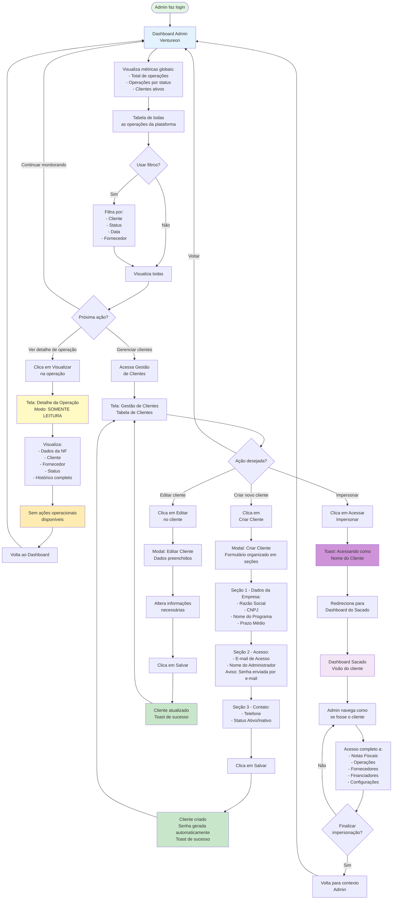

# Fluxo - Admin: Monitoramento e Impersonação

## Descrição
Fluxo do Admin (Ventureon) para monitoramento global da plataforma e suporte aos clientes através de impersonação.

## Diagrama Mermaid

## Responsabilidades do Admin

### 1. Monitoramento Global
- **Visualização**: Acesso a todas as operações da plataforma
- **Métricas**: Dashboard com indicadores agregados
- **Filtros**: Capacidade de filtrar por cliente, status, data
- **Somente leitura**: Não pode modificar operações

### 2. Gestão de Clientes
- **Criar**: Cadastrar novos clientes (Sacados)
- **Editar**: Atualizar informações dos clientes
- **Ativar/Desativar**: Gerenciar status dos clientes
- **Visualizar**: Ver lista completa de clientes

### 3. Impersonação (Suporte)
- **Acesso como cliente**: Navegar na interface do Sacado
- **Diagnóstico**: Identificar problemas reportados
- **Suporte**: Auxiliar clientes com dúvidas
- **Sem modificações**: Não pode executar ações operacionais

## Limitações do Admin

### ❌ O que Admin NÃO pode fazer:
- Criar notas fiscais
- Criar operações
- Aprovar ou rejeitar operações
- Selecionar financiadores
- Marcar operações como financiadas
- Cadastrar fornecedores ou financiadores
- Modificar configurações do programa do cliente

### ✅ O que Admin PODE fazer:
- Visualizar todas as operações (somente leitura)
- Criar e gerenciar clientes (Sacados)
- Impersonar clientes para suporte
- Monitorar métricas globais
- Filtrar e buscar operações

## Fluxo de Impersonação

1. Admin acessa "Gestão de Clientes"
2. Identifica cliente que precisa de suporte
3. Clica em "Acessar" (Impersonar)
4. Toast confirma: "Acessando como [Nome do Cliente]"
5. Redireciona para Dashboard do Sacado
6. Admin navega como se fosse o cliente
7. Pode visualizar todas as telas do cliente
8. Não pode executar ações operacionais
9. Finaliza impersonação voltando ao contexto Admin

## Casos de Uso

### Caso 1: Monitoramento de Operações
- Admin verifica operações pendentes
- Identifica gargalos no processo
- Analisa métricas de aprovação
- Não interfere nas operações

### Caso 2: Suporte ao Cliente
- Cliente reporta problema na interface
- Admin impersona o cliente
- Navega pelas telas para reproduzir o problema
- Identifica a causa e orienta o cliente

### Caso 3: Onboarding de Novo Cliente (Detalhado)

#### Passo 1: Criação do Cliente
- Admin acessa "Gestão de Clientes"
- Clica em "Criar Cliente"
- Modal abre com formulário organizado em 3 seções

#### Passo 2: Preenchimento dos Dados

**Seção 1 - Dados da Empresa:**
- Razão Social (obrigatório)
- CNPJ (obrigatório)
- Nome do Programa (obrigatório)
- Prazo Médio de Pagamento (opcional)

**Seção 2 - Acesso à Plataforma:**
- E-mail de Acesso (obrigatório) - Será usado para login
- Nome do Administrador (obrigatório) - Pessoa responsável
- Aviso: "Senha inicial será enviada automaticamente para o e-mail cadastrado"

**Seção 3 - Contato:**
- Telefone (opcional)
- Status: Ativo/Inativo (obrigatório)

#### Passo 3: Criação e Configuração Automática
- Admin clica em "Criar Cliente"
- Sistema cria cliente no banco (mock)
- Senha inicial é gerada automaticamente
- E-mail com credenciais é enviado (mock)
- Toast confirma: "Cliente criado com sucesso!"

#### Passo 4: Primeiro Acesso do Cliente
- Cliente recebe e-mail com:
  - Link de acesso à plataforma
  - E-mail de login
  - Senha temporária
- Cliente acessa a plataforma
- Faz login com credenciais recebidas
- (Futuro) Sistema solicita troca de senha no primeiro acesso

#### Passo 5: Configuração Inicial pelo Cliente
Após primeiro login, cliente pode:
- Configurar dados da empresa (Minha Empresa)
- Adicionar membros da equipe (Equipe)
- Cadastrar fornecedores
- Cadastrar financiadores
- Configurar programa de risco sacado
- Começar a cadastrar notas fiscais

## Comportamento Visual

- **Dashboard Admin**: Tema diferenciado do Sacado
- **Badge "Admin"**: Identificação visual do contexto
- **Toast de impersonação**: Confirma mudança de contexto
- **Botões desabilitados**: Em modo impersonação, ações operacionais ficam visualmente desabilitadas
- **Indicador de contexto**: Mostra quando está impersonando
