# Fluxo - Onboarding de Novo Cliente

## Descrição
Fluxo completo de cadastro de um novo cliente pelo Admin da Ventureon, incluindo configuração de acesso e primeiro login.

## Diagrama Mermaid

```mermaid
flowchart TD
    Start([Admin Ventureon<br/>decide criar cliente]) --> AcessaGestao[Acessa Gestão<br/>de Clientes]
    
    AcessaGestao --> ClicaCriar[Clica em<br/>Criar Cliente]
    
    ClicaCriar --> ModalAberto[Modal: Novo Cliente<br/>Formulário em 3 seções]
    
    ModalAberto --> Secao1[Seção 1: Dados da Empresa]
    
    Secao1 --> PreencheEmpresa[Preenche:<br/>- Razão Social *<br/>- CNPJ *<br/>- Nome do Programa *<br/>- Prazo Médio Pagamento]
    
    PreencheEmpresa --> Secao2[Seção 2: Acesso à Plataforma]
    
    Secao2 --> PreencheAcesso[Preenche:<br/>- E-mail de Acesso *<br/>- Nome do Administrador *]
    
    PreencheAcesso --> AvisoSenha[Aviso exibido:<br/>Senha será enviada<br/>automaticamente por e-mail]
    
    AvisoSenha --> Secao3[Seção 3: Contato]
    
    Secao3 --> PreencheContato[Preenche:<br/>- Telefone<br/>- Status: Ativo/Inativo *]
    
    PreencheContato --> Validacao{Todos os campos<br/>obrigatórios<br/>preenchidos?}
    
    Validacao -->|Não| ErroValidacao[Mensagem de erro:<br/>Preencha campos obrigatórios]
    ErroValidacao --> Secao1
    
    Validacao -->|Sim| ClicaSalvar[Admin clica em<br/>Criar Cliente]
    
    ClicaSalvar --> SistemaCria[Sistema cria cliente<br/>no banco de dados]
    
    SistemaCria --> GeraSenha[Sistema gera<br/>senha temporária<br/>automaticamente]
    
    GeraSenha --> EnviaEmail[Sistema envia e-mail<br/>para o endereço cadastrado]
    
    EnviaEmail --> EmailConteudo[E-mail contém:<br/>- Link da plataforma<br/>- E-mail de login<br/>- Senha temporária<br/>- Instruções de acesso]
    
    EmailConteudo --> ToastSucesso[Toast: Cliente criado<br/>com sucesso!]
    
    ToastSucesso --> ClienteNaTabela[Cliente aparece<br/>na tabela com<br/>Status: Ativo]
    
    ClienteNaTabela --> FimAdmin([Fim - Lado Admin])
    
    %% Fluxo do Cliente
    
    EmailConteudo --> ClienteRecebe[Cliente recebe e-mail<br/>com credenciais]
    
    ClienteRecebe --> ClienteAcessa[Cliente acessa<br/>link da plataforma]
    
    ClienteAcessa --> TelaLogin[Tela de Login]
    
    TelaLogin --> ClienteDigita[Cliente digita:<br/>- E-mail recebido<br/>- Senha temporária]
    
    ClienteDigita --> ValidaCredenciais{Credenciais<br/>válidas?}
    
    ValidaCredenciais -->|Não| ErroLogin[Erro: Credenciais<br/>inválidas]
    ErroLogin --> TelaLogin
    
    ValidaCredenciais -->|Sim| PrimeiroAcesso{É primeiro<br/>acesso?}
    
    PrimeiroAcesso -->|Sim - Futuro| TrocaSenha[Solicita troca<br/>de senha]
    TrocaSenha --> NovaSenha[Cliente define<br/>nova senha]
    NovaSenha --> DashboardSacado
    
    PrimeiroAcesso -->|Não - MVP| DashboardSacado[Redireciona para<br/>Dashboard Sacado]
    
    DashboardSacado --> BoasVindas[Tela de boas-vindas<br/>ou tour guiado]
    
    BoasVindas --> ConfigInicial{Cliente deseja<br/>configurar agora?}
    
    ConfigInicial -->|Sim| ConfigEmpresa[Acessa Minha Empresa<br/>e completa dados]
    ConfigInicial -->|Não| UsarPlataforma[Começa a usar<br/>a plataforma]
    
    ConfigEmpresa --> ConfigEquipe[Adiciona membros<br/>da equipe]
    ConfigEquipe --> ConfigFornecedores[Cadastra fornecedores]
    ConfigFornecedores --> ConfigFinanciadores[Cadastra financiadores]
    ConfigFinanciadores --> ConfigPrograma[Configura programa<br/>de risco sacado]
    ConfigPrograma --> ProntoUsar[Cliente pronto<br/>para usar]
    
    UsarPlataforma --> ProntoUsar
    ProntoUsar --> FimCliente([Fim - Cliente<br/>configurado])

    style Start fill:#e1f5e1
    style GeraSenha fill:#fff9c4
    style EnviaEmail fill:#b3e5fc
    style ToastSucesso fill:#c8e6c9
    style DashboardSacado fill:#f3e5f5
    style ProntoUsar fill:#c8e6c9
    style FimAdmin fill:#e1f5e1
    style FimCliente fill:#e1f5e1
    style ErroValidacao fill:#ffcdd2
    style ErroLogin fill:#ffcdd2
```



## Detalhamento do Fluxo

### Fase 1: Cadastro pelo Admin (Ventureon)

#### Campos Obrigatórios:
- **Razão Social**: Nome legal da empresa
- **CNPJ**: Identificação fiscal
- **Nome do Programa**: Identificador do programa de risco sacado
- **E-mail de Acesso**: Será usado para login (validação de formato)
- **Nome do Administrador**: Pessoa responsável pelo acesso inicial
- **Status**: Ativo ou Inativo

#### Campos Opcionais:
- **Prazo Médio de Pagamento**: Ex: "30 dias"
- **Telefone**: Para contato e suporte

#### Validações:
- E-mail deve ter formato válido
- CNPJ deve ter formato válido (XX.XXX.XXX/XXXX-XX)
- Todos os campos obrigatórios devem estar preenchidos
- Status "Ativo" permite acesso, "Inativo" bloqueia

### Fase 2: Geração Automática de Credenciais

#### O que o sistema faz automaticamente:
1. Cria registro do cliente no banco de dados (mock)
2. Gera senha temporária aleatória e segura
3. Cria usuário administrador vinculado ao cliente
4. Prepara e-mail com credenciais
5. Envia e-mail para o endereço cadastrado
6. Registra data de onboarding

#### Conteúdo do E-mail (Mock):
```
Assunto: Bem-vindo à Plataforma Ventureon

Olá [Nome do Administrador],

Sua empresa [Razão Social] foi cadastrada na plataforma Ventureon!

Acesse a plataforma através do link:
https://plataforma.ventureon.com.br

Suas credenciais de acesso:
E-mail: [E-mail cadastrado]
Senha temporária: [Senha gerada]

Por segurança, recomendamos trocar sua senha no primeiro acesso.

Atenciosamente,
Equipe Ventureon
```

### Fase 3: Primeiro Acesso do Cliente

#### Passo 1: Login
- Cliente acessa link da plataforma
- Insere e-mail e senha temporária
- Sistema valida credenciais
- Redireciona para Dashboard Sacado

#### Passo 2: Troca de Senha (Futuro - Não no MVP)
- Sistema detecta primeiro acesso
- Solicita nova senha
- Cliente define senha permanente
- Sistema atualiza credenciais

#### Passo 3: Configuração Inicial (Opcional)
Cliente pode configurar:
1. **Minha Empresa**: Completar dados cadastrais, endereço, contato
2. **Equipe**: Adicionar outros usuários com diferentes perfis
3. **Fornecedores**: Cadastrar fornecedores do programa
4. **Financiadores**: Cadastrar instituições financiadoras
5. **Programa**: Configurar parâmetros do programa de risco sacado

### Fase 4: Uso da Plataforma

Após configuração inicial, cliente pode:
- Cadastrar notas fiscais
- Criar operações
- Aprovar/rejeitar operações
- Selecionar financiadores
- Marcar operações como financiadas
- Gerenciar equipe e empresa

## Estados do Cliente

1. **Criado**: Cliente cadastrado, aguardando primeiro acesso
2. **Ativo - Primeiro Acesso**: Cliente fez login pela primeira vez
3. **Ativo - Configurado**: Cliente completou configuração inicial
4. **Ativo - Em Uso**: Cliente está operando normalmente
5. **Inativo**: Cliente bloqueado pelo Admin

## Validações e Regras

### Validações de Cadastro:
- E-mail único (não pode duplicar)
- CNPJ único (não pode duplicar)
- Formato de e-mail válido
- Formato de CNPJ válido
- Campos obrigatórios preenchidos

### Regras de Acesso:
- Apenas clientes com status "Ativo" podem fazer login
- Senha temporária válida por tempo indeterminado (MVP)
- E-mail é case-insensitive para login
- Senha é case-sensitive

### Regras de Segurança (Futuro):
- Senha deve ter mínimo 8 caracteres
- Senha deve conter letras e números
- Forçar troca de senha no primeiro acesso
- Senha temporária expira em 24h
- Bloqueio após 5 tentativas incorretas

## Comportamento Visual

### Modal de Criação:
- 3 seções claramente separadas
- Campos obrigatórios marcados com *
- Aviso destacado sobre senha automática
- Validação em tempo real de e-mail e CNPJ
- Botão "Criar Sacado" desabilitado até validação completa

### Feedback ao Admin:
- Toast verde: "Sacado criado com sucesso!"
- Cliente aparece imediatamente na tabela
- Badge "Ativo" ou "Inativo" visível

### Tela de Login (Cliente):
- Campo de e-mail
- Campo de senha (oculta caracteres)
- Botão "Entrar"
- Link "Esqueci minha senha" (futuro)
- Mensagens de erro claras

### Dashboard Inicial (Cliente):
- Mensagem de boas-vindas personalizada
- Tour guiado opcional (futuro)
- Links rápidos para configuração inicial
- Indicador de progresso de setup (futuro)

## Diferenças MVP vs Futuro

### No MVP (Atual):
- ✅ Senha gerada automaticamente
- ✅ E-mail enviado (mock)
- ✅ Login com credenciais
- ✅ Acesso direto ao dashboard
- ❌ Sem troca obrigatória de senha
- ❌ Sem expiração de senha temporária
- ❌ Sem tour guiado
- ❌ Sem indicador de progresso

### No Futuro:
- ✅ Troca obrigatória de senha no primeiro acesso
- ✅ Senha temporária expira em 24h
- ✅ Tour guiado interativo
- ✅ Indicador de progresso de configuração
- ✅ E-mail de confirmação real
- ✅ Recuperação de senha
- ✅ Autenticação de dois fatores (2FA)
