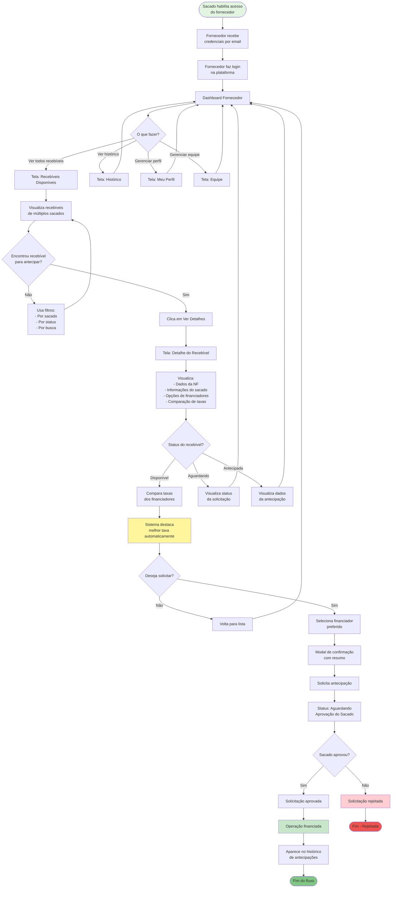

# Fluxo Completo - Jornada do Fornecedor

## Descrição
Fluxo end-to-end do fornecedor, desde o recebimento de acesso até a antecipação de recebíveis.

## Diagrama Mermaid

## Pontos de Decisão Principais

1. **Dashboard**: Ponto central de navegação do fornecedor
2. **Visualização Consolidada**: Fornecedor vê recebíveis de TODOS os sacados
3. **Comparação de Financiadores**: Escolha informada baseada em taxas
4. **Solicitação de Antecipação**: Ação do fornecedor, aprovação do sacado
5. **Acompanhamento**: Histórico completo de operações

## Estados do Recebível (Visão do Fornecedor)

- **Disponível para Antecipar**: Recebível pronto, fornecedor pode solicitar
- **Aguardando Aprovação**: Solicitação enviada, pendente decisão do sacado
- **Antecipada**: Operação finalizada, valor recebido

## Diferencial da Jornada

- **Multi-sacado**: Fornecedor vê recebíveis de todas as empresas em um só lugar
- **Autonomia**: Fornecedor pode solicitar antecipação diretamente
- **Transparência**: Comparação clara de taxas e valores
- **Rastreabilidade**: Histórico completo de todas as operações
- **Gestão de Equipe**: Fornecedor pode gerenciar permissões de seus funcionários
