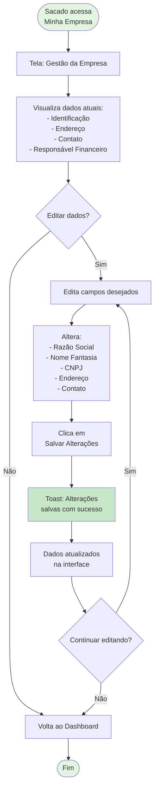
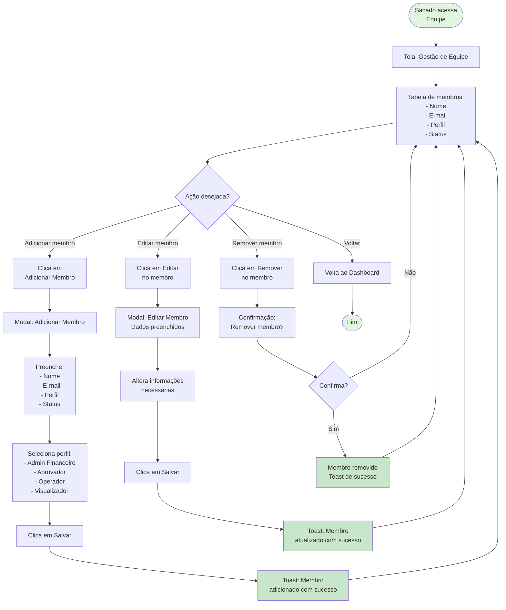
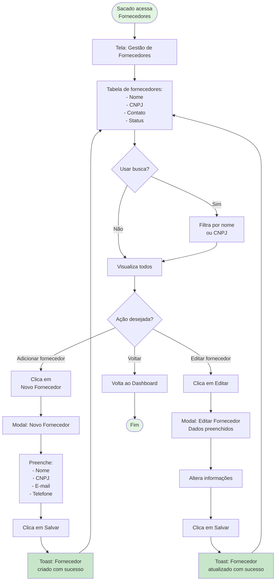

# Fluxo - Telas de Gerenciamento do Sacado

## Descrição
Fluxo das telas de gerenciamento interno do Sacado: Empresa, Equipe, Fornecedores e Financiadores.

## Diagrama Mermaid - Gestão da Empresa



## Diagrama Mermaid - Gestão de Equipe



## Diagrama Mermaid - Gestão de Fornecedores



## Diagrama Mermaid - Gestão de Financiadores

```mermaid
flowchart TD
    Start([Sacado acessa<br/>Financiadores]) --> TelaFin[Tela: Gestão de Financiadores]
    
    TelaFin --> TabelaFin[Tabela de financiadores:<br/>- Nome<br/>- Tipo<br/>- Taxa Base<br/>- Prazo Máximo<br/>- Status]
    
    TabelaFin --> BuscaFin{Usar busca?}
    BuscaFin -->|Sim| FiltraFin[Filtra por nome<br/>ou tipo]
    BuscaFin -->|Não| VisualizaTodos[Visualiza todos]
    
    FiltraFin --> VisualizaTodos
    
    VisualizaTodos --> InfoImportante[Info: Apenas financiadores<br/>ATIVOS aparecem nas<br/>comparações de operações]
    
    InfoImportante --> Decision1{Ação desejada?}
    
    Decision1 -->|Adicionar financiador| BotaoAddFin[Clica em<br/>Novo Financiador]
    Decision1 -->|Editar financiador| BotaoEditFin[Clica em Editar]
    Decision1 -->|Voltar| VoltaDash[Volta ao Dashboard]
    
    BotaoAddFin --> ModalAddFin[Modal: Novo Financiador]
    ModalAddFin --> PreencheFin[Preenche:<br/>- Nome<br/>- Tipo de Instituição<br/>- Taxa Base<br/>- Prazo Máximo<br/>- Contato<br/>- Status]
    
    PreencheFin --> SelecionaTipo[Seleciona tipo:<br/>- Banco<br/>- Financeira<br/>- Fintech<br/>- Cooperativa]
    
    SelecionaTipo --> DefineTaxa[Define taxa base<br/>mensal (%)]
    DefineTaxa --> DefineStatus[Define status:<br/>- Ativo<br/>- Inativo]
    
    DefineStatus --> SalvaFin[Clica em Salvar]
    SalvaFin --> ToastAddFin[Toast: Financiador<br/>criado com sucesso]
    ToastAddFin --> TabelaFin
    
    BotaoEditFin --> ModalEditFin[Modal: Editar Financiador<br/>Dados preenchidos]
    ModalEditFin --> AlteraFin[Altera informações<br/>necessárias]
    AlteraFin --> AlteraStatus{Alterar status?}
    
    AlteraStatus -->|Sim| AvisoStatus[Aviso: Status afeta<br/>comparações futuras]
    AlteraStatus -->|Não| SalvaEditFin[Clica em Salvar]
    
    AvisoStatus --> SalvaEditFin
    SalvaEditFin --> ToastEditFin[Toast: Financiador<br/>atualizado com sucesso]
    ToastEditFin --> TabelaFin
    
    VoltaDash --> Fim([Fim])

    style Start fill:#e1f5e1
    style InfoImportante fill:#fff9c4
    style AvisoStatus fill:#ffecb3
    style ToastAddFin fill:#c8e6c9
    style ToastEditFin fill:#c8e6c9
    style Fim fill:#e1f5e1
```

## Perfis de Acesso (Equipe)

### Admin Financeiro
- Acesso completo a todas as funcionalidades
- Pode gerenciar equipe
- Pode configurar empresa e programa

### Aprovador
- Pode aprovar/rejeitar operações
- Pode selecionar financiadores
- Pode marcar como financiada

### Operador
- Pode cadastrar notas fiscais
- Pode criar operações
- Pode visualizar operações

### Visualizador
- Somente leitura
- Pode visualizar todas as telas
- Não pode executar ações

## Regras de Negócio

### Fornecedores
- **Obrigatório**: Nome e CNPJ
- **Opcional**: E-mail e telefone
- **Vinculação**: Associado ao Sacado
- **Uso**: Aparece no select de cadastro de NF

### Financiadores
- **Obrigatório**: Nome, tipo, taxa base, prazo, status
- **Status Ativo**: Aparece nas comparações de operações
- **Status Inativo**: Não aparece em novas operações
- **Taxa Base**: Usada para cálculo de propostas (mock)

### Empresa
- **Dados cadastrais**: Razão social, CNPJ, IE
- **Endereço completo**: Cidade, estado, logradouro
- **Contato**: Nome, e-mail, telefone
- **Responsável financeiro**: Pessoa de contato principal

### Equipe
- **Perfis predefinidos**: 4 níveis de acesso
- **Status**: Ativo ou Inativo
- **E-mail único**: Não permite duplicação
- **Remoção**: Confirmação obrigatória

## Comportamento Visual

- **Modais**: Todas as criações/edições em modais
- **Toasts**: Confirmação de sucesso em todas as ações
- **Badges de status**: Cores diferentes para Ativo/Inativo
- **Busca em tempo real**: Filtragem instantânea
- **Tabelas responsivas**: Adaptam-se ao tamanho da tela
- **Validação de campos**: Feedback visual imediato
