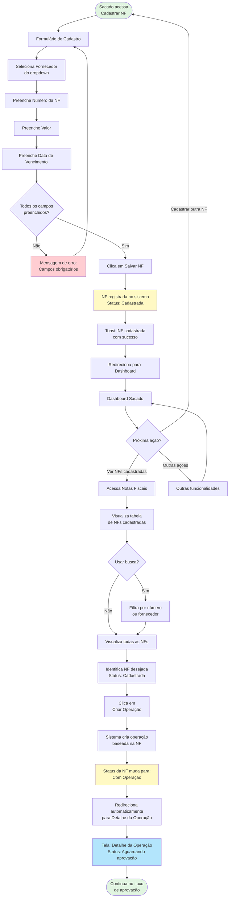

# Fluxo - Cadastro de NF e Criação de Operação

## Descrição
Fluxo específico do processo de cadastro de nota fiscal e criação de operação pelo Sacado.

## Diagrama Mermaid

## Detalhes do Fluxo

### Fase 1: Cadastro da Nota Fiscal
1. Sacado acessa menu "Cadastrar NF"
2. Preenche formulário com dados obrigatórios
3. Sistema valida campos
4. NF é salva com status "Cadastrada"
5. Usuário retorna ao Dashboard

### Fase 2: Visualização de NFs
1. Sacado acessa "Notas Fiscais"
2. Visualiza lista de todas as NFs cadastradas
3. Pode usar busca para filtrar
4. Identifica NFs com status "Cadastrada"

### Fase 3: Criação de Operação
1. Sacado clica em "Criar Operação" na NF desejada
2. Sistema cria operação automaticamente
3. Status da NF muda para "Com Operação"
4. Usuário é redirecionado para tela de detalhe
5. Operação entra em status "Aguardando aprovação"

## Validações

- **Campos obrigatórios**: Fornecedor, Número, Valor, Vencimento
- **Status da NF**: Apenas NFs "Cadastrada" podem criar operação
- **Fornecedor**: Deve estar cadastrado e ativo no sistema

## Comportamento Visual

- **Toast de sucesso**: Após salvar NF
- **Mudança de badge**: Status muda visualmente na tabela
- **Botão contextual**: "Criar Operação" só aparece para NFs sem operação
- **Redirecionamento automático**: Após criar operação
