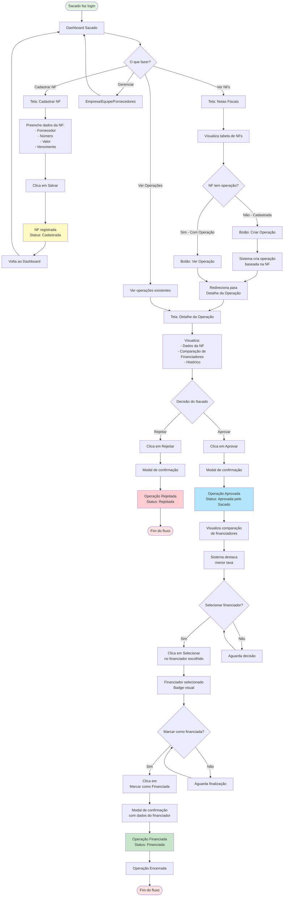

# Fluxo Completo - Jornada do Sacado

## Descrição
Fluxo end-to-end completo do Sacado, desde o cadastro de nota fiscal até a finalização da operação financiada.

## Diagrama Mermaid

## Pontos de Decisão Principais

1. **Dashboard**: Ponto central de navegação
2. **Cadastro vs Visualização**: Sacado pode cadastrar nova NF ou ver NFs existentes
3. **Criar Operação**: Ação manual do Sacado na lista de NFs
4. **Aprovar/Rejeitar**: Decisão crítica de governança
5. **Selecionar Financiador**: Escolha entre propostas
6. **Marcar como Financiada**: Finalização do processo

## Estados da Operação

- **Cadastrada** (NF): Nota fiscal registrada, sem operação
- **Com Operação** (NF): Operação criada para a NF
- **Aguardando aprovação**: Operação criada, pendente decisão
- **Aprovada pelo Sacado**: Operação aprovada, aguardando seleção de financiador
- **Financiada**: Operação concluída
- **Rejeitada**: Operação não aprovada pelo Sacado
- **Encerrada**: Ciclo completo finalizado
