# Todos os Flowcharts JTBD - Compilados

## 1. JTBD: Antecipar Recebíveis com Segurança e Transparência

```mermaid
flowchart TD
    Start([Necessidade: Melhorar fluxo de caixa]) --> Situacao[Situação: Tenho NFs a receber mas preciso de liquidez]
    
    Situacao --> Motivacao{Por que antecipar?}
    
    Motivacao -->|Pagar fornecedores| Urgencia1[Urgência: Alta - Prazo curto]
    Motivacao -->|Aproveitar oportunidade| Urgencia2[Urgência: Média - Investimento]
    Motivacao -->|Planejamento| Urgencia3[Urgência: Baixa - Estratégia]
    
    Urgencia1 --> AcessaPlataforma[Acessa plataforma Ventureon]
    Urgencia2 --> AcessaPlataforma
    Urgencia3 --> AcessaPlataforma
    
    AcessaPlataforma --> VerificaNFs[Verifica NFs cadastradas]
    
    VerificaNFs --> Decision1{Tem NFs cadastradas?}
    
    Decision1 -->|Não| CadastraNF[Job auxiliar: Cadastrar NF rapidamente]
    Decision1 -->|Sim| SelecionaNF[Seleciona NF para antecipar]
    
    CadastraNF --> SelecionaNF
    
    SelecionaNF --> CriaOperacao[Cria operação baseada na NF]
    
    CriaOperacao --> VisualizaOpcoes[Visualiza opções de financiadores]
    
    VisualizaOpcoes --> Criterios{Critério de escolha?}
    
    Criterios -->|Menor taxa| FocoTaxa[Prioriza: Economia no custo]
    Criterios -->|Rapidez| FocoVelocidade[Prioriza: Velocidade de crédito]
    Criterios -->|Relacionamento| FocoRelacionamento[Prioriza: Parceiro conhecido]
    
    FocoTaxa --> ComparaOpcoes[Compara taxas e valores líquidos]
    FocoVelocidade --> ComparaOpcoes
    FocoRelacionamento --> ComparaOpcoes
    
    ComparaOpcoes --> SistemaDestaca[Sistema destaca menor taxa automaticamente]
    
    SistemaDestaca --> Decision2{Satisfeito com as opções?}
    
    Decision2 -->|Não| Rejeita[Rejeita operação - Busca alternativas]
    Decision2 -->|Sim| AprovaOperacao[Aprova operação]
    
    Rejeita --> FimNegativo([Job não concluído: Buscar outras soluções])
    
    AprovaOperacao --> SelecionaFinanciador[Seleciona financiador preferido]
    
    SelecionaFinanciador --> ConfirmaFinanciamento[Confirma financiamento com dados claros]
    
    ConfirmaFinanciamento --> OperacaoFinalizada[Operação financiada - Status: Concluída]
    
    OperacaoFinalizada --> ResultadoEsperado[Resultado alcançado: ✓ Liquidez obtida ✓ Custo conhecido ✓ Processo transparente]
    
    ResultadoEsperado --> MedeSucesso{Job bem-sucedido?}
    
    MedeSucesso -->|Sim| Satisfacao[Satisfação: Processo rápido, Taxas competitivas, Transparência total]
    MedeSucesso -->|Não| Frustacao[Frustrações: Processo lento, Taxas altas, Falta de clareza]
    
    Satisfacao --> FimPositivo([Job concluído com sucesso])
    Frustacao --> Melhorias[Oportunidades de melhoria]
    Melhorias --> FimPositivo

    style Start fill:#e1f5e1
    style ResultadoEsperado fill:#c8e6c9
    style Satisfacao fill:#a5d6a7
    style FimPositivo fill:#81c784
    style Frustacao fill:#ffcdd2
    style FimNegativo fill:#ef5350
    style SistemaDestaca fill:#fff59d
```

## 2. JTBD: Comparar Opções de Financiamento de Forma Inteligente

```mermaid
flowchart TD
    Start([Necessidade: Escolher melhor financiador]) --> Situacao[Situação: Operação aprovada - Múltiplas opções disponíveis]
    
    Situacao --> Objetivo[Objetivo: Minimizar custo - Maximizar valor líquido]
    
    Objetivo --> AcessaComparacao[Acessa tela de comparação de financiadores]
    
    AcessaComparacao --> VisualizaTabela[Visualiza tabela comparativa]
    
    VisualizaTabela --> ElementosTabela[Elementos visíveis: Nome do financiador, Taxa mensal, Valor líquido, Prazo]
    
    ElementosTabela --> SistemaDestaca[Sistema destaca MENOR TAXA automaticamente]
    
    SistemaDestaca --> Decision1{Como analisar?}
    
    Decision1 -->|Análise rápida| VerDestaque[Foca no financiador destacado pelo sistema]
    Decision1 -->|Análise detalhada| ComparaTodos[Compara todos os financiadores]
    
    VerDestaque --> VerificaMenorTaxa[Verifica: É realmente a menor taxa?]
    ComparaTodos --> VerificaMenorTaxa
    
    VerificaMenorTaxa --> CalculaMental[Calcula mentalmente ou usa calculadora]
    
    CalculaMental --> Decision2{Precisa de mais informações?}
    
    Decision2 -->|Sim| BuscaDetalhes[Busca detalhes: Histórico com financiador, Reputação, Condições especiais]
    Decision2 -->|Não| TemConfianca[Tem confiança na decisão]
    
    BuscaDetalhes --> Decision3{Informações disponíveis?}
    
    Decision3 -->|Não| Frustracao1[Frustração: Falta de contexto]
    Decision3 -->|Sim| TemConfianca
    
    Frustracao1 --> DecisaoSemContexto[Decide baseado apenas em taxa]
    
    DecisaoSemContexto --> TemConfianca
    
    TemConfianca --> Criterios{Critério final?}
    
    Criterios -->|Menor taxa| SelecionaMenorTaxa[Seleciona financiador com menor taxa]
    Criterios -->|Relacionamento| SelecionaConhecido[Seleciona financiador conhecido]
    Criterios -->|Equilibrio| SelecionaEquilibrio[Seleciona melhor custo-benefício]
    
    SelecionaMenorTaxa --> ConfirmaSelecao[Clica em Selecionar no financiador escolhido]
    SelecionaConhecido --> ConfirmaSelecao
    SelecionaEquilibrio --> ConfirmaSelecao
    
    ConfirmaSelecao --> FeedbackVisual[Feedback visual: Badge Selecionado]
    
    FeedbackVisual --> ProximoPasso[Próximo passo: Marcar como financiada]
    
    ProximoPasso --> ResultadoEsperado[Resultado alcançado: ✓ Melhor opção escolhida ✓ Custo minimizado ✓ Decisão informada]
    
    ResultadoEsperado --> MedeSucesso{Job bem-sucedido?}
    
    MedeSucesso -->|Sim| Satisfacao[Satisfação: Comparação clara, Decisão rápida, Confiança na escolha]
    MedeSucesso -->|Não| Frustracoes[Frustrações: Falta de contexto, Dúvidas sobre diferenças, Incerteza na decisão]
    
    Satisfacao --> FimPositivo([Job concluído com sucesso])
    Frustracoes --> Melhorias[Oportunidades: Mais informações, Histórico de operações, Recomendações]
    Melhorias --> FimPositivo

    style Start fill:#e1f5e1
    style SistemaDestaca fill:#fff59d
    style ResultadoEsperado fill:#c8e6c9
    style Satisfacao fill:#a5d6a7
    style FimPositivo fill:#81c784
    style Frustracao1 fill:#ffcdd2
    style Frustracoes fill:#ffcdd2
```

## 3. JTBD: Gerenciar Fornecedores de Forma Centralizada

```mermaid
flowchart TD
    Start([Necessidade: Organizar fornecedores]) --> Situacao[Situação: Preciso cadastrar NF mas fornecedor não existe]
    
    Situacao --> Motivacao{Por que gerenciar?}
    
    Motivacao -->|Criar operação| Urgente[Urgência: Alta Preciso agora]
    Motivacao -->|Organização| Planejado[Urgência: Média Manutenção preventiva]
    Motivacao -->|Onboarding| Inicial[Urgência: Alta Setup inicial]
    
    Urgente --> AcessaFornecedores[Acessa tela de Fornecedores]
    Planejado --> AcessaFornecedores
    Inicial --> AcessaFornecedores
    
    AcessaFornecedores --> VisualizaLista[Visualiza lista de fornecedores existentes]
    
    VisualizaLista --> Decision1{Fornecedor já existe?}
    
    Decision1 -->|Sim| UsaBusca[Usa busca para localizar rapidamente]
    Decision1 -->|Não| ClicaNovo[Clica em Novo Fornecedor]
    
    UsaBusca --> EncontraFornecedor[Encontra fornecedor na lista]
    
    EncontraFornecedor --> Decision2{Precisa atualizar?}
    
    Decision2 -->|Não| UsaFornecedor[Usa fornecedor em operação]
    Decision2 -->|Sim| ClicaEditar[Clica em Editar]
    
    ClicaNovo --> ModalCadastro[Modal: Novo Fornecedor]
    ClicaEditar --> ModalEdicao[Modal: Editar Fornecedor]
    
    ModalCadastro --> PreencheCampos[Preenche campos: - Nome * - CNPJ * - E-mail - Telefone]
    
    ModalEdicao --> AlteraDados[Altera dados necessários]
    
    PreencheCampos --> Decision3{Tem todos os dados?}
    
    Decision3 -->|Não| BuscaDados[Busca dados: - Nota fiscal - Contrato - E-mail anterior]
    Decision3 -->|Sim| ValidaCNPJ[Sistema valida formato do CNPJ]
    
    BuscaDados --> Decision4{Conseguiu os dados?}
    
    Decision4 -->|Não| PreencheParcial[Preenche apenas campos obrigatórios]
    Decision4 -->|Sim| ValidaCNPJ
    
    PreencheParcial --> ValidaCNPJ
    AlteraDados --> ValidaCNPJ
    
    ValidaCNPJ --> Decision5{CNPJ válido?}
    
    Decision5 -->|Não| ErroValidacao[Erro: CNPJ inválido]
    Decision5 -->|Sim| ClicaSalvar[Clica em Salvar]
    
    ErroValidacao --> CorrigeCNPJ[Corrige CNPJ]
    CorrigeCNPJ --> ValidaCNPJ
    
    ClicaSalvar --> FornecedorSalvo[Fornecedor salvo Toast de sucesso]
    
    FornecedorSalvo --> ApareceLista[Fornecedor aparece na lista]
    
    ApareceLista --> Decision6{Próxima ação?}
    
    Decision6 -->|Cadastrar outro| ClicaNovo
    Decision6 -->|Usar em operação| UsaFornecedor
    Decision6 -->|Finalizar| VoltaDashboard[Volta ao Dashboard]
    
    UsaFornecedor --> CriaNF[Cria NF com fornecedor selecionado]
    
    CriaNF --> ResultadoEsperado[Resultado alcançado: ✓ Fornecedor cadastrado ✓ Dados organizados ✓ Pronto para usar]
    
    VoltaDashboard --> ResultadoEsperado
    
    ResultadoEsperado --> MedeSucesso{Job bem-sucedido?}
    
    MedeSucesso -->|Sim| Satisfacao[Satisfação: - Cadastro rápido - Fácil de encontrar - Dados organizados]
    MedeSucesso -->|Não| Frustracoes[Frustrações: - Campos demais - Validação rígida - Difícil de editar]
    
    Satisfacao --> FimPositivo([Job concluído com sucesso])
    Frustracoes --> Melhorias[Oportunidades: - Importação em lote - Integração com ERP - Validação flexível]
    Melhorias --> FimPositivo

    style Start fill:#e1f5e1
    style FornecedorSalvo fill:#c8e6c9
    style ResultadoEsperado fill:#c8e6c9
    style Satisfacao fill:#a5d6a7
    style FimPositivo fill:#81c784
    style ErroValidacao fill:#ffcdd2
    style Frustracoes fill:#ffcdd2
```

## 4. JTBD: Monitorar Operações de Clientes Eficientemente (Admin)

```mermaid
flowchart TD
    Start([Necessidade: Monitorar plataforma]) --> Situacao[Situação: Responsável por múltiplos clientes e operações]
    
    Situacao --> Motivacao{Por que monitorar?}
    
    Motivacao -->|Suporte reativo| Ticket[Cliente reportou problema]
    Motivacao -->|Monitoramento proativo| Rotina[Verificação de rotina]
    Motivacao -->|Análise| Metricas[Análise de performance]
    
    Ticket --> AcessaDashboard[Acessa Dashboard Admin]
    Rotina --> AcessaDashboard
    Metricas --> AcessaDashboard
    
    AcessaDashboard --> VisualizaGlobal[Visualiza métricas globais]
    
    VisualizaGlobal --> ElementosVisiveis[Elementos visíveis: - Total de operações - Por status - Por cliente - Alertas]
    
    ElementosVisiveis --> Decision1{Há algo anormal?}
    
    Decision1 -->|Sim| IdentificaProblema[Identifica: - Operações travadas - Erros - Reclamações]
    Decision1 -->|Não| MonitoramentoNormal[Tudo funcionando normalmente]
    
    MonitoramentoNormal --> Decision2{Precisa de ação?}
    
    Decision2 -->|Não| ContinuaMonitorando[Continua monitorando]
    Decision2 -->|Sim| AcaoProativa[Ação proativa: - Contatar cliente - Otimizar processo]
    
    IdentificaProblema --> UsaFiltros[Usa filtros: - Por cliente - Por status - Por data]
    
    UsaFiltros --> LocalizaOperacao[Localiza operação específica]
    
    LocalizaOperacao --> VisualizaDetalhe[Clica em Visualizar na operação]
    
    VisualizaDetalhe --> TelaDetalhe[Tela: Detalhe da Operação Modo: SOMENTE LEITURA]
    
    TelaDetalhe --> AnalisaContexto[Analisa: - Dados da NF - Cliente - Fornecedor - Histórico - Status atual]
    
    AnalisaContexto --> Decision3{Consegue diagnosticar?}
    
    Decision3 -->|Não| PrecisaMaisInfo[Precisa de mais informações]
    Decision3 -->|Sim| IdentificaCausa[Identifica causa do problema]
    
    PrecisaMaisInfo --> Decision4{Impersonar cliente?}
    
    Decision4 -->|Sim| AcessaGestaoClientes[Acessa Gestão de Clientes]
    Decision4 -->|Não| ContataDireto[Contata cliente diretamente]
    
    AcessaGestaoClientes --> LocalizaCliente[Localiza cliente na lista]
    
    LocalizaCliente --> ClicaImpersonar[Clica em Acessar Impersonar]
    
    ClicaImpersonar --> ToastImpersona[Toast: Acessando como Nome do Cliente]
    
    ToastImpersona --> DashboardCliente[Dashboard do Cliente Visão completa]
    
    DashboardCliente --> NavegaComoCliente[Navega pelas telas como se fosse o cliente]
    
    NavegaComoCliente --> ReproduProblema[Reproduz problema reportado]
    
    ReproduProblema --> Decision5{Problema identificado?}
    
    Decision5 -->|Não| BuscaOutrasCausas[Busca outras causas possíveis]
    Decision5 -->|Sim| DocumentaProblema[Documenta: - Causa - Impacto - Solução]
    
    BuscaOutrasCausas --> Decision5
    
    IdentificaCausa --> DocumentaProblema
    ContataDireto --> DocumentaProblema
    
    DocumentaProblema --> Decision6{Pode resolver sozinho?}
    
    Decision6 -->|Sim| OrientaCliente[Orienta cliente sobre solução]
    Decision6 -->|Não| EscalaTime[Escala para time técnico]
    
    OrientaCliente --> ClienteResolve[Cliente resolve o problema]
    EscalaTime --> TimeResolve[Time técnico resolve]
    
    ClienteResolve --> VoltaAdmin[Volta para contexto Admin]
    TimeResolve --> VoltaAdmin
    AcaoProativa --> VoltaAdmin
    
    VoltaAdmin --> VerificaResolucao[Verifica se problema foi resolvido]
    
    VerificaResolucao --> Decision7{Resolvido?}
    
    Decision7 -->|Não| InvestigaMais[Investiga mais profundamente]
    Decision7 -->|Sim| RegistraSolucao[Registra solução para referência futura]
    
    InvestigaMais --> Decision3
    
    RegistraSolucao --> ResultadoEsperado[Resultado alcançado: ✓ Problema identificado ✓ Cliente auxiliado ✓ Plataforma funcionando]
    
    ContinuaMonitorando --> ResultadoEsperado
    
    ResultadoEsperado --> MedeSucesso{Job bem-sucedido?}
    
    MedeSucesso -->|Sim| Satisfacao[Satisfação: - Problema resolvido rápido - Cliente satisfeito - Processo documentado]
    MedeSucesso -->|Não| Frustracoes[Frustrações: - Falta de ferramentas - Informações insuficientes - Processo lento]
    
    Satisfacao --> FimPositivo([Job concluído com sucesso])
    Frustracoes --> Melhorias[Oportunidades: - Logs mais detalhados - Alertas automáticos - Ferramentas de diagnóstico]
    Melhorias --> FimPositivo

    style Start fill:#e1f5e1
    style ToastImpersona fill:#ce93d8
    style DocumentaProblema fill:#fff9c4
    style ResultadoEsperado fill:#c8e6c9
    style Satisfacao fill:#a5d6a7
    style FimPositivo fill:#81c784
    style Frustracoes fill:#ffcdd2
```

## 5. JTBD: Começar a Usar a Plataforma Rapidamente

```mermaid
flowchart TD
    Start([Necessidade: Começar a usar a plataforma]) --> RecebeEmail[Recebe e-mail com credenciais]
    
    RecebeEmail --> Expectativa[Expectativa: Processo simples e rápido]
    
    Expectativa --> AcessaLink[Clica no link da plataforma]
    
    AcessaLink --> TelaLogin[Tela de Login]
    
    TelaLogin --> DigitaCredenciais[Digita: - E-mail - Senha temporária]
    
    DigitaCredenciais --> Decision1{Credenciais corretas?}
    
    Decision1 -->|Não| ErroLogin[Erro de login Frustração inicial]
    Decision1 -->|Sim| PrimeiroAcesso[Primeiro acesso bem-sucedido]
    
    ErroLogin --> TentaNovamente[Tenta novamente ou recupera senha]
    TentaNovamente --> TelaLogin
    
    PrimeiroAcesso --> Dashboard[Dashboard Sacado Primeira impressão]
    
    Dashboard --> Decision2{Interface intuitiva?}
    
    Decision2 -->|Não| Confusao[Confusão: Não sabe por onde começar]
    Decision2 -->|Sim| Exploracao[Explora menu lateral]
    
    Confusao --> BuscaAjuda[Busca ajuda: - Documentação - Suporte - Tutorial]
    
    BuscaAjuda --> Decision3{Encontrou ajuda?}
    
    Decision3 -->|Não| Frustracao1[Frustração: Falta de orientação]
    Decision3 -->|Sim| Exploracao
    
    Frustracao1 --> TentaSozinho[Tenta descobrir sozinho]
    TentaSozinho --> Exploracao
    
    Exploracao --> IdentificaOpcoes[Identifica opções: - Minha Empresa - Fornecedores - Financiadores - Notas Fiscais]
    
    IdentificaOpcoes --> Decision4{O que fazer primeiro?}
    
    Decision4 -->|Configurar dados| ConfigEmpresa[Acessa Minha Empresa]
    Decision4 -->|Cadastrar base| CadastroBase[Cadastra: - Fornecedores - Financiadores]
    Decision4 -->|Começar operação| CriaNF[Cria primeira Nota Fiscal]
    
    ConfigEmpresa --> PreencheDados[Preenche dados da empresa]
    PreencheDados --> SalvaEmpresa[Salva informações]
    
    CadastroBase --> CadastraFornecedor[Cadastra fornecedores principais]
    CadastraFornecedor --> CadastraFinanciador[Cadastra financiadores conhecidos]
    
    CriaNF --> Decision5{Tem fornecedor cadastrado?}
    
    Decision5 -->|Não| PrecisaCadastrar[Precisa cadastrar fornecedor primeiro]
    Decision5 -->|Sim| PreencheNF[Preenche dados da NF]
    
    PrecisaCadastrar --> CadastraFornecedor
    
    SalvaEmpresa --> ProximaEtapa[Próxima etapa de configuração]
    CadastraFinanciador --> ProximaEtapa
    PreencheNF --> SalvaNF[Salva NF]
    
    ProximaEtapa --> Decision6{Configuração completa?}
    
    Decision6 -->|Não| ContinuaConfig[Continua configurando]
    Decision6 -->|Sim| ProntoOperar[Pronto para operar]
    
    ContinuaConfig --> Decision4
    SalvaNF --> ProntoOperar
    
    ProntoOperar --> PrimeiraOperacao[Cria primeira operação]
    
    PrimeiraOperacao --> AprovaOperacao[Aprova e seleciona financiador]
    
    AprovaOperacao --> OperacaoConcluida[Primeira operação concluída]
    
    OperacaoConcluida --> ResultadoEsperado[Resultado alcançado: ✓ Plataforma configurada ✓ Primeira operação feita ✓ Entendeu o fluxo]
    
    ResultadoEsperado --> MedeSucesso{Job bem-sucedido?}
    
    MedeSucesso -->|Sim| Satisfacao[Satisfação: - Processo intuitivo - Rápido para começar - Sem fricção]
    MedeSucesso -->|Não| Frustracoes[Frustrações: - Muitas etapas - Falta de orientação - Configuração complexa]
    
    Satisfacao --> FimPositivo([Job concluído Usuário ativo])
    Frustracoes --> Melhorias[Oportunidades: - Tour guiado - Onboarding progressivo - Assistente virtual]
    Melhorias --> FimPositivo

    style Start fill:#e1f5e1
    style PrimeiroAcesso fill:#b3e5fc
    style OperacaoConcluida fill:#c8e6c9
    style ResultadoEsperado fill:#c8e6c9
    style Satisfacao fill:#a5d6a7
    style FimPositivo fill:#81c784
    style ErroLogin fill:#ffcdd2
    style Confusao fill:#ffecb3
    style Frustracao1 fill:#ffcdd2
    style Frustracoes fill:#ffcdd2
```

## 6. JTBD: Rastrear Status de Operações em Andamento

```mermaid
flowchart TD
    Start([Necessidade: Saber status das operações]) --> Situacao[Situação: Tenho operações criadas em diferentes estágios]
    
    Situacao --> Motivacao{Por que rastrear?}
    
    Motivacao -->|Urgência| PrecisaAprovar[Precisa aprovar operações pendentes]
    Motivacao -->|Planejamento| PreveCaixa[Previsão de fluxo de caixa]
    Motivacao -->|Controle| AcompanhaProcesso[Acompanha evolução]
    
    PrecisaAprovar --> AcessaDashboard[Acessa Dashboard Sacado]
    PreveCaixa --> AcessaDashboard
    AcompanhaProcesso --> AcessaDashboard
    
    AcessaDashboard --> VisualizaCards[Visualiza cards de resumo]
    
    VisualizaCards --> ElementosVisiveis[Elementos visíveis: - Aguardando aprovação - Aprovadas - Encerradas]
    
    ElementosVisiveis --> Decision1{Há operações pendentes?}
    
    Decision1 -->|Não| TudoOK[Tudo em dia Sem ações necessárias]
    Decision1 -->|Sim| IdentificaPendentes[Identifica operações que precisam atenção]
    
    TudoOK --> Decision2{Quer ver histórico?}
    
    Decision2 -->|Não| FimRapido([Fim - Verificação rápida concluída])
    Decision2 -->|Sim| VisualizaTabela[Visualiza tabela de operações]
    
    IdentificaPendentes --> VisualizaTabela
    
    VisualizaTabela --> AnalisaTabela[Analisa: - ID da operação - Fornecedor - Valor - Vencimento - Status]
    
    AnalisaTabela --> Decision3{Precisa de mais detalhes?}
    
    Decision3 -->|Não| TomaDecisao[Toma decisão baseada na tabela]
    Decision3 -->|Sim| ClicaOperacao[Clica na operação para ver detalhes]
    
    ClicaOperacao --> TelaDetalhe[Tela: Detalhe da Operação]
    
    TelaDetalhe --> VisualizaCompleto[Visualiza informações completas]
    
    VisualizaCompleto --> ElementosDetalhe[Elementos visíveis: - Dados da NF - Comparação financiadores - Histórico de eventos - Status atual - Ações disponíveis]
    
    ElementosDetalhe --> VerificaHistorico[Verifica histórico de eventos]
    
    VerificaHistorico --> Timeline[Timeline mostra: - Data/hora de cada evento - Tipo de ação - Usuário responsável - Detalhes relevantes]
    
    Timeline --> Decision4{Status atual?}
    
    Decision4 -->|Aguardando aprovação| PodeAprovar[Pode aprovar ou rejeitar]
    Decision4 -->|Aprovada| PodeSelecionar[Pode selecionar financiador]
    Decision4 -->|Financiada| ApenasVisualiza[Apenas visualização Operação concluída]
    
    PodeAprovar --> Decision5{Vai aprovar agora?}
    
    Decision5 -->|Sim| AprovaOperacao[Aprova operação e seleciona financiador]
    Decision5 -->|Não| VoltaDashboard[Volta ao Dashboard para ver outras]
    
    PodeSelecionar --> Decision6{Já selecionou financiador?}
    
    Decision6 -->|Não| SelecionaFin[Seleciona financiador e marca como financiada]
    Decision6 -->|Sim| MarcaFinanciada[Marca como financiada]
    
    ApenasVisualiza --> Decision7{Satisfeito com resultado?}
    
    Decision7 -->|Sim| OperacaoConcluida[Operação concluída conforme esperado]
    Decision7 -->|Não| IdentificaProblema[Identifica problema ou melhoria]
    
    AprovaOperacao --> OperacaoAvancou[Operação avançou no processo]
    SelecionaFin --> OperacaoAvancou
    MarcaFinanciada --> OperacaoAvancou
    
    OperacaoAvancou --> AtualizaStatus[Status atualizado em tempo real]
    
    AtualizaStatus --> NovoEvento[Novo evento no histórico]
    
    NovoEvento --> Decision8{Tem mais operações?}
    
    Decision8 -->|Sim| VoltaDashboard
    Decision8 -->|Não| TodasRevisadas[Todas operações revisadas]
    
    TomaDecisao --> TodasRevisadas
    VoltaDashboard --> VisualizaTabela
    OperacaoConcluida --> TodasRevisadas
    IdentificaProblema --> TodasRevisadas
    
    TodasRevisadas --> ResultadoEsperado[Resultado alcançado: ✓ Status conhecido ✓ Ações tomadas ✓ Controle mantido]
    
    ResultadoEsperado --> MedeSucesso{Job bem-sucedido?}
    
    MedeSucesso -->|Sim| Satisfacao[Satisfação: - Visibilidade clara - Fácil de acompanhar - Histórico completo]
    MedeSucesso -->|Não| Frustracoes[Frustrações: - Informação incompleta - Difícil de encontrar - Falta de contexto]
    
    Satisfacao --> FimPositivo([Job concluído com sucesso])
    Frustracoes --> Melhorias[Oportunidades: - Notificações push - Alertas de prazo - Dashboard mais rico]
    Melhorias --> FimPositivo

    style Start fill:#e1f5e1
    style Timeline fill:#fff9c4
    style AtualizaStatus fill:#b3e5fc
    style ResultadoEsperado fill:#c8e6c9
    style Satisfacao fill:#a5d6a7
    style FimPositivo fill:#81c784
    style FimRapido fill:#81c784
    style Frustracoes fill:#ffcdd2
```

