# JTBD: Antecipar Recebíveis com Segurança e Transparência

## Job Statement
**Quando** tenho notas fiscais a receber de fornecedores,  
**Eu quero** antecipar esses recebíveis de forma rápida e transparente,  
**Para que** eu possa melhorar meu fluxo de caixa e tomar decisões financeiras informadas.

## Contexto do Job
- **Persona**: CFO ou Gerente Financeiro de empresa Sacado
- **Situação**: Empresa tem contas a pagar e precisa de liquidez
- **Frequência**: Semanal ou conforme necessidade de caixa
- **Importância**: Alta - impacta diretamente o capital de giro

## Diagrama Mermaid - Fluxo JTBD

```mermaid
flowchart TD
    Start([Necessidade:<br/>Melhorar fluxo de caixa]) --> Situacao[Situação:<br/>Tenho NFs a receber<br/>mas preciso de liquidez]
    
    Situacao --> Motivacao{Por que antecipar?}
    
    Motivacao -->|Pagar fornecedores| Urgencia1[Urgência: Alta<br/>Prazo curto]
    Motivacao -->|Aproveitar oportunidade| Urgencia2[Urgência: Média<br/>Investimento]
    Motivacao -->|Planejamento| Urgencia3[Urgência: Baixa<br/>Estratégia]
    
    Urgencia1 --> AcessaPlataforma[Acessa plataforma<br/>Ventureon]
    Urgencia2 --> AcessaPlataforma
    Urgencia3 --> AcessaPlataforma
    
    AcessaPlataforma --> VerificaNFs[Verifica NFs<br/>cadastradas]
    
    VerificaNFs --> Decision1{Tem NFs<br/>cadastradas?}
    
    Decision1 -->|Não| CadastraNF[Job auxiliar:<br/>Cadastrar NF rapidamente]
    Decision1 -->|Sim| SelecionaNF[Seleciona NF<br/>para antecipar]
    
    CadastraNF --> SelecionaNF
    
    SelecionaNF --> CriaOperacao[Cria operação<br/>baseada na NF]
    
    CriaOperacao --> VisualizaOpcoes[Visualiza opções<br/>de financiadores]
    
    VisualizaOpcoes --> Criterios{Critério de escolha?}
    
    Criterios -->|Menor taxa| FocoTaxa[Prioriza:<br/>Economia no custo]
    Criterios -->|Rapidez| FocoVelocidade[Prioriza:<br/>Velocidade de crédito]
    Criterios -->|Relacionamento| FocoRelacionamento[Prioriza:<br/>Parceiro conhecido]
    
    FocoTaxa --> ComparaOpcoes[Compara taxas<br/>e valores líquidos]
    FocoVelocidade --> ComparaOpcoes
    FocoRelacionamento --> ComparaOpcoes
    
    ComparaOpcoes --> SistemaDestaca[Sistema destaca<br/>menor taxa automaticamente]
    
    SistemaDestaca --> Decision2{Satisfeito com<br/>as opções?}
    
    Decision2 -->|Não| Rejeita[Rejeita operação<br/>Busca alternativas]
    Decision2 -->|Sim| AprovaOperacao[Aprova operação]
    
    Rejeita --> FimNegativo([Job não concluído:<br/>Buscar outras soluções])
    
    AprovaOperacao --> SelecionaFinanciador[Seleciona financiador<br/>preferido]
    
    SelecionaFinanciador --> ConfirmaFinanciamento[Confirma financiamento<br/>com dados claros]
    
    ConfirmaFinanciamento --> OperacaoFinalizada[Operação financiada<br/>Status: Concluída]
    
    OperacaoFinalizada --> ResultadoEsperado[Resultado alcançado:<br/>✓ Liquidez obtida<br/>✓ Custo conhecido<br/>✓ Processo transparente]
    
    ResultadoEsperado --> MedeSucesso{Job bem-sucedido?}
    
    MedeSucesso -->|Sim| Satisfacao[Satisfação:<br/>- Processo rápido<br/>- Taxas competitivas<br/>- Transparência total]
    MedeSucesso -->|Não| Frustacao[Frustrações:<br/>- Processo lento<br/>- Taxas altas<br/>- Falta de clareza]
    
    Satisfacao --> FimPositivo([Job concluído<br/>com sucesso])
    Frustacao --> Melhorias[Oportunidades<br/>de melhoria]
    Melhorias --> FimPositivo

    style Start fill:#e1f5e1
    style ResultadoEsperado fill:#c8e6c9
    style Satisfacao fill:#a5d6a7
    style FimPositivo fill:#81c784
    style Frustacao fill:#ffcdd2
    style FimNegativo fill:#ef5350
    style SistemaDestaca fill:#fff59d
```

## Critérios de Sucesso do Job

### Funcionais (O que precisa acontecer)
1. ✅ **Velocidade**: Criar operação em menos de 5 minutos
2. ✅ **Comparação**: Ver todas as opções de financiamento lado a lado
3. ✅ **Transparência**: Conhecer custo total antes de aprovar
4. ✅ **Controle**: Poder aprovar ou rejeitar a qualquer momento
5. ✅ **Rastreabilidade**: Acompanhar status da operação

### Emocionais (Como o usuário quer se sentir)
1. 😌 **Confiança**: Sentir que está tomando a melhor decisão
2. 🎯 **Controle**: Ter autonomia sobre as escolhas financeiras
3. 💡 **Informado**: Entender claramente custos e benefícios
4. ⚡ **Eficiência**: Não perder tempo com processos burocráticos
5. 🤝 **Segurança**: Confiar na plataforma e nos parceiros

### Sociais (Como quer ser percebido)
1. 👔 **Profissional**: Demonstrar gestão financeira competente
2. 📊 **Estratégico**: Mostrar decisões baseadas em dados
3. 💼 **Responsável**: Garantir saúde financeira da empresa
4. 🚀 **Inovador**: Usar tecnologia para otimizar processos

## Obstáculos e Soluções

### Obstáculo 1: Falta de NFs cadastradas
**Solução na plataforma:**
- Cadastro rápido de NF (menos de 2 minutos)
- Campos mínimos obrigatórios
- Validação em tempo real

### Obstáculo 2: Dificuldade em comparar opções
**Solução na plataforma:**
- Tabela comparativa clara
- Destaque automático da menor taxa
- Cálculo de valor líquido para cada opção

### Obstáculo 3: Incerteza sobre custos
**Solução na plataforma:**
- Exibição clara de taxas
- Cálculo de valor líquido
- Sem custos ocultos

### Obstáculo 4: Processo lento
**Solução na plataforma:**
- Aprovação em poucos cliques
- Sem necessidade de documentação adicional
- Confirmação imediata

### Obstáculo 5: Falta de histórico
**Solução na plataforma:**
- Timeline de eventos da operação
- Registro de todas as ações
- Dados disponíveis para auditoria

## Métricas de Sucesso do Job

### Métricas de Eficiência
- ⏱️ **Tempo médio para criar operação**: < 5 minutos
- ⏱️ **Tempo médio para aprovar**: < 2 minutos
- 📊 **Taxa de conclusão**: > 80%

### Métricas de Satisfação
- ⭐ **NPS da funcionalidade**: > 50
- 😊 **Satisfação com transparência**: > 4.5/5
- 💰 **Percepção de economia**: > 4/5

### Métricas de Adoção
- 📈 **Operações criadas por mês**: Crescimento constante
- 🔄 **Taxa de retorno**: > 70%
- 📱 **Frequência de uso**: Semanal ou quinzenal

## Alternativas Competitivas

### Antes da plataforma (Como faziam)
1. ❌ Contato direto com bancos (lento, burocrático)
2. ❌ Negociação individual (sem comparação)
3. ❌ Planilhas manuais (propenso a erros)
4. ❌ Falta de visibilidade de opções

### Outras soluções no mercado
1. 🏦 Bancos tradicionais: Processo lento, taxas altas
2. 💳 Fintechs de crédito: Foco em crédito, não em antecipação
3. 📊 Plataformas de gestão: Não oferecem financiamento

### Vantagem da plataforma Ventureon
- ✅ Comparação de múltiplos financiadores
- ✅ Processo 100% digital e rápido
- ✅ Transparência total de custos
- ✅ Controle e autonomia do Sacado
- ✅ Histórico e rastreabilidade

## Evolução do Job

### MVP (Atual)
- Cadastro de NF
- Criação de operação
- Comparação de financiadores
- Aprovação e seleção

### Futuro Próximo
- Sugestão automática de NFs para antecipar
- Previsão de fluxo de caixa
- Alertas de oportunidades
- Negociação de taxas

### Visão de Longo Prazo
- IA para otimizar decisões
- Integração com ERP
- Antecipação automática baseada em regras
- Marketplace de financiadores
