# JTBD: Gerenciar Fornecedores de Forma Centralizada

## Job Statement
**Quando** preciso organizar e manter atualizado meu cadastro de fornecedores,  
**Eu quero** ter uma base centralizada e fácil de gerenciar,  
**Para que** eu possa criar operações rapidamente e manter relacionamentos organizados.

## Contexto do Job
- **Persona**: CFO, Gerente Financeiro ou Operador Financeiro
- **Situação**: Precisa cadastrar ou atualizar fornecedores
- **Frequência**: Semanal ou conforme novos fornecedores surgem
- **Importância**: Média - facilita operações futuras

## Diagrama Mermaid - Fluxo JTBD

```mermaid
flowchart TD
    Start([Necessidade:<br/>Organizar fornecedores]) --> Situacao[Situação:<br/>Preciso cadastrar NF<br/>mas fornecedor não existe]
    
    Situacao --> Motivacao{Por que gerenciar?}
    
    Motivacao -->|Criar operação| Urgente[Urgência: Alta<br/>Preciso agora]
    Motivacao -->|Organização| Planejado[Urgência: Média<br/>Manutenção preventiva]
    Motivacao -->|Onboarding| Inicial[Urgência: Alta<br/>Setup inicial]
    
    Urgente --> AcessaFornecedores[Acessa tela de<br/>Fornecedores]
    Planejado --> AcessaFornecedores
    Inicial --> AcessaFornecedores
    
    AcessaFornecedores --> VisualizaLista[Visualiza lista<br/>de fornecedores existentes]
    
    VisualizaLista --> Decision1{Fornecedor<br/>já existe?}
    
    Decision1 -->|Sim| UsaBusca[Usa busca para<br/>localizar rapidamente]
    Decision1 -->|Não| ClicaNovo[Clica em<br/>Novo Fornecedor]
    
    UsaBusca --> EncontraFornecedor[Encontra fornecedor<br/>na lista]
    
    EncontraFornecedor --> Decision2{Precisa<br/>atualizar?}
    
    Decision2 -->|Não| UsaFornecedor[Usa fornecedor<br/>em operação]
    Decision2 -->|Sim| ClicaEditar[Clica em Editar]
    
    ClicaNovo --> ModalCadastro[Modal:<br/>Novo Fornecedor]
    ClicaEditar --> ModalEdicao[Modal:<br/>Editar Fornecedor]
    
    ModalCadastro --> PreencheCampos[Preenche campos:<br/>- Nome *<br/>- CNPJ *<br/>- E-mail<br/>- Telefone]
    
    ModalEdicao --> AlteraDados[Altera dados<br/>necessários]
    
    PreencheCampos --> Decision3{Tem todos<br/>os dados?}
    
    Decision3 -->|Não| BuscaDados[Busca dados:<br/>- Nota fiscal<br/>- Contrato<br/>- E-mail anterior]
    Decision3 -->|Sim| ValidaCNPJ[Sistema valida<br/>formato do CNPJ]
    
    BuscaDados --> Decision4{Conseguiu<br/>os dados?}
    
    Decision4 -->|Não| PreencheParcial[Preenche apenas<br/>campos obrigatórios]
    Decision4 -->|Sim| ValidaCNPJ
    
    PreencheParcial --> ValidaCNPJ
    AlteraDados --> ValidaCNPJ
    
    ValidaCNPJ --> Decision5{CNPJ válido?}
    
    Decision5 -->|Não| ErroValidacao[Erro:<br/>CNPJ inválido]
    Decision5 -->|Sim| ClicaSalvar[Clica em Salvar]
    
    ErroValidacao --> CorrigeCNPJ[Corrige CNPJ]
    CorrigeCNPJ --> ValidaCNPJ
    
    ClicaSalvar --> FornecedorSalvo[Fornecedor salvo<br/>Toast de sucesso]
    
    FornecedorSalvo --> ApareceLista[Fornecedor aparece<br/>na lista]
    
    ApareceLista --> Decision6{Próxima ação?}
    
    Decision6 -->|Cadastrar outro| ClicaNovo
    Decision6 -->|Usar em operação| UsaFornecedor
    Decision6 -->|Finalizar| VoltaDashboard[Volta ao Dashboard]
    
    UsaFornecedor --> CriaNF[Cria NF com<br/>fornecedor selecionado]
    
    CriaNF --> ResultadoEsperado[Resultado alcançado:<br/>✓ Fornecedor cadastrado<br/>✓ Dados organizados<br/>✓ Pronto para usar]
    
    VoltaDashboard --> ResultadoEsperado
    
    ResultadoEsperado --> MedeSucesso{Job bem-sucedido?}
    
    MedeSucesso -->|Sim| Satisfacao[Satisfação:<br/>- Cadastro rápido<br/>- Fácil de encontrar<br/>- Dados organizados]
    MedeSucesso -->|Não| Frustracoes[Frustrações:<br/>- Campos demais<br/>- Validação rígida<br/>- Difícil de editar]
    
    Satisfacao --> FimPositivo([Job concluído<br/>com sucesso])
    Frustracoes --> Melhorias[Oportunidades:<br/>- Importação em lote<br/>- Integração com ERP<br/>- Validação flexível]
    Melhorias --> FimPositivo

    style Start fill:#e1f5e1
    style FornecedorSalvo fill:#c8e6c9
    style ResultadoEsperado fill:#c8e6c9
    style Satisfacao fill:#a5d6a7
    style FimPositivo fill:#81c784
    style ErroValidacao fill:#ffcdd2
    style Frustracoes fill:#ffcdd2
```

## Critérios de Sucesso do Job

### Funcionais (O que precisa acontecer)
1. ✅ **Rapidez**: Cadastrar fornecedor em menos de 2 minutos
2. ✅ **Busca**: Encontrar fornecedor existente rapidamente
3. ✅ **Validação**: CNPJ validado automaticamente
4. ✅ **Edição**: Atualizar dados facilmente
5. ✅ **Disponibilidade**: Fornecedor disponível imediatamente após salvar

### Emocionais (Como o usuário quer se sentir)
1. 🎯 **Organizado**: Ter controle sobre a base de fornecedores
2. ⚡ **Eficiente**: Não perder tempo com cadastros complexos
3. 😌 **Tranquilo**: Saber que dados estão corretos e acessíveis
4. 💡 **Preparado**: Ter fornecedores prontos para operações futuras
5. 🧹 **Limpo**: Base de dados organizada e atualizada

### Sociais (Como quer ser percebido)
1. 📋 **Organizado**: Demonstrar gestão eficiente de relacionamentos
2. 🎓 **Profissional**: Manter dados corporativos atualizados
3. 🤝 **Confiável**: Ter informações corretas dos parceiros
4. 📊 **Metódico**: Seguir processos estruturados

## Obstáculos e Soluções

### Obstáculo 1: Não tem todos os dados do fornecedor
**Solução na plataforma:**
- Apenas Nome e CNPJ são obrigatórios
- E-mail e telefone opcionais
- Pode completar dados depois

### Obstáculo 2: CNPJ incorreto ou inválido
**Solução na plataforma:**
- Validação automática de formato
- Mensagem de erro clara
- Permite correção imediata

### Obstáculo 3: Muitos fornecedores para gerenciar
**Solução na plataforma:**
- Busca em tempo real
- Filtro por nome ou CNPJ
- Lista organizada alfabeticamente

### Obstáculo 4: Dados desatualizados
**Solução na plataforma:**
- Edição fácil e rápida
- Modal com dados preenchidos
- Atualização imediata

### Obstáculo 5: Duplicação de fornecedores
**Solução atual:**
- Busca antes de cadastrar
**Melhoria futura:**
- Detecção automática de duplicatas
- Sugestão de merge
- Validação de CNPJ único

## Métricas de Sucesso do Job

### Métricas de Eficiência
- ⏱️ **Tempo médio de cadastro**: < 2 minutos
- 🔍 **Uso da busca**: > 60%
- ✏️ **Taxa de edição**: < 20% (dados corretos desde início)

### Métricas de Qualidade
- ✅ **Dados completos**: > 80% com e-mail e telefone
- 🎯 **CNPJ válidos**: 100%
- 🔄 **Taxa de duplicação**: < 5%

### Métricas de Adoção
- 📈 **Fornecedores cadastrados por mês**: Crescimento constante
- 🔄 **Fornecedores reutilizados**: > 70%
- 📊 **Base ativa**: > 80% usados em operações

## Informações Necessárias para o Job

### Essenciais (Obrigatórios)
1. ✅ Nome/Razão Social
2. ✅ CNPJ

### Importantes (Opcionais mas recomendados)
1. 📧 E-mail
2. 📱 Telefone
3. 📍 Endereço (futuro)

### Desejáveis (Longo prazo)
1. 💼 Categoria/Segmento
2. 📊 Volume médio de operações
3. 🏷️ Tags personalizadas
4. 📝 Observações

## Alternativas Competitivas

### Antes da plataforma
1. ❌ Planilha Excel (desorganizada, sem validação)
2. ❌ Anotações dispersas (difícil de encontrar)
3. ❌ Memória (propenso a erros)
4. ❌ Sistema ERP (complexo, lento)

### Outras soluções
1. 📊 CRM: Foco em vendas, não em fornecedores
2. 💼 ERP: Muito complexo para necessidade simples
3. 📋 Planilhas: Sem validação, sem integração

### Vantagem da plataforma
- ✅ Específico para o contexto de antecipação
- ✅ Integrado com criação de NF
- ✅ Validação automática
- ✅ Busca rápida
- ✅ Sempre disponível

## Evolução do Job

### MVP (Atual)
- Cadastro manual
- Campos básicos
- Busca simples
- Edição individual

### Futuro Próximo
- Importação em lote (CSV)
- Detecção de duplicatas
- Histórico de operações por fornecedor
- Status ativo/inativo

### Visão de Longo Prazo
- Integração com ERP
- Enriquecimento automático de dados
- Categorização inteligente
- Sugestão de fornecedores para operações
- Analytics de relacionamento
