# JTBD: Monitorar Operações de Clientes Eficientemente (Admin)

## Job Statement
**Quando** preciso acompanhar as operações de todos os clientes da plataforma,  
**Eu quero** ter visibilidade global e ferramentas de suporte eficientes,  
**Para que** eu possa garantir o bom funcionamento da plataforma e auxiliar clientes quando necessário.

## Contexto do Job
- **Persona**: Admin Ventureon (operador da plataforma)
- **Situação**: Monitoramento diário de operações
- **Frequência**: Diária ou várias vezes ao dia
- **Importância**: Alta - garante qualidade do serviço

## Diagrama Mermaid - Fluxo JTBD

```mermaid
flowchart TD
    Start([Necessidade:<br/>Monitorar plataforma]) --> Situacao[Situação:<br/>Responsável por múltiplos<br/>clientes e operações]
    
    Situacao --> Motivacao{Por que monitorar?}
    
    Motivacao -->|Suporte reativo| Ticket[Cliente reportou<br/>problema]
    Motivacao -->|Monitoramento proativo| Rotina[Verificação<br/>de rotina]
    Motivacao -->|Análise| Metricas[Análise de<br/>performance]
    
    Ticket --> AcessaDashboard[Acessa Dashboard<br/>Admin]
    Rotina --> AcessaDashboard
    Metricas --> AcessaDashboard
    
    AcessaDashboard --> VisualizaGlobal[Visualiza métricas<br/>globais]
    
    VisualizaGlobal --> ElementosVisiveis[Elementos visíveis:<br/>- Total de operações<br/>- Por status<br/>- Por cliente<br/>- Alertas]
    
    ElementosVisiveis --> Decision1{Há algo<br/>anormal?}
    
    Decision1 -->|Sim| IdentificaProblema[Identifica:<br/>- Operações travadas<br/>- Erros<br/>- Reclamações]
    Decision1 -->|Não| MonitoramentoNormal[Tudo funcionando<br/>normalmente]
    
    MonitoramentoNormal --> Decision2{Precisa de<br/>ação?}
    
    Decision2 -->|Não| ContinuaMonitorando[Continua<br/>monitorando]
    Decision2 -->|Sim| AcaoProativa[Ação proativa:<br/>- Contatar cliente<br/>- Otimizar processo]
    
    IdentificaProblema --> UsaFiltros[Usa filtros:<br/>- Por cliente<br/>- Por status<br/>- Por data]
    
    UsaFiltros --> LocalizaOperacao[Localiza operação<br/>específica]
    
    LocalizaOperacao --> VisualizaDetalhe[Clica em Visualizar<br/>na operação]
    
    VisualizaDetalhe --> TelaDetalhe[Tela: Detalhe da Operação<br/>Modo: SOMENTE LEITURA]
    
    TelaDetalhe --> AnalisaContexto[Analisa:<br/>- Dados da NF<br/>- Cliente<br/>- Fornecedor<br/>- Histórico<br/>- Status atual]
    
    AnalisaContexto --> Decision3{Consegue<br/>diagnosticar?}
    
    Decision3 -->|Não| PrecisaMaisInfo[Precisa de mais<br/>informações]
    Decision3 -->|Sim| IdentificaCausa[Identifica causa<br/>do problema]
    
    PrecisaMaisInfo --> Decision4{Impersonar<br/>cliente?}
    
    Decision4 -->|Sim| AcessaGestaoClientes[Acessa Gestão<br/>de Clientes]
    Decision4 -->|Não| ContataDireto[Contata cliente<br/>diretamente]
    
    AcessaGestaoClientes --> LocalizaCliente[Localiza cliente<br/>na lista]
    
    LocalizaCliente --> ClicaImpersonar[Clica em Acessar<br/>Impersonar]
    
    ClicaImpersonar --> ToastImpersona[Toast: Acessando como<br/>Nome do Cliente]
    
    ToastImpersona --> DashboardCliente[Dashboard do Cliente<br/>Visão completa]
    
    DashboardCliente --> NavegaComoCliente[Navega pelas telas<br/>como se fosse o cliente]
    
    NavegaComoCliente --> ReproduProblema[Reproduz problema<br/>reportado]
    
    ReproduProblema --> Decision5{Problema<br/>identificado?}
    
    Decision5 -->|Não| BuscaOutrasCausas[Busca outras<br/>causas possíveis]
    Decision5 -->|Sim| DocumentaProblema[Documenta:<br/>- Causa<br/>- Impacto<br/>- Solução]
    
    BuscaOutrasCausas --> Decision5
    
    IdentificaCausa --> DocumentaProblema
    ContataDireto --> DocumentaProblema
    
    DocumentaProblema --> Decision6{Pode resolver<br/>sozinho?}
    
    Decision6 -->|Sim| OrientaCliente[Orienta cliente<br/>sobre solução]
    Decision6 -->|Não| EscalaTime[Escala para time<br/>técnico]
    
    OrientaCliente --> ClienteResolve[Cliente resolve<br/>o problema]
    EscalaTime --> TimeResolve[Time técnico<br/>resolve]
    
    ClienteResolve --> VoltaAdmin[Volta para contexto<br/>Admin]
    TimeResolve --> VoltaAdmin
    AcaoProativa --> VoltaAdmin
    
    VoltaAdmin --> VerificaResolucao[Verifica se problema<br/>foi resolvido]
    
    VerificaResolucao --> Decision7{Resolvido?}
    
    Decision7 -->|Não| InvestigaMais[Investiga mais<br/>profundamente]
    Decision7 -->|Sim| RegistraSolucao[Registra solução<br/>para referência futura]
    
    InvestigaMais --> Decision3
    
    RegistraSolucao --> ResultadoEsperado[Resultado alcançado:<br/>✓ Problema identificado<br/>✓ Cliente auxiliado<br/>✓ Plataforma funcionando]
    
    ContinuaMonitorando --> ResultadoEsperado
    
    ResultadoEsperado --> MedeSucesso{Job bem-sucedido?}
    
    MedeSucesso -->|Sim| Satisfacao[Satisfação:<br/>- Problema resolvido rápido<br/>- Cliente satisfeito<br/>- Processo documentado]
    MedeSucesso -->|Não| Frustracoes[Frustrações:<br/>- Falta de ferramentas<br/>- Informações insuficientes<br/>- Processo lento]
    
    Satisfacao --> FimPositivo([Job concluído<br/>com sucesso])
    Frustracoes --> Melhorias[Oportunidades:<br/>- Logs mais detalhados<br/>- Alertas automáticos<br/>- Ferramentas de diagnóstico]
    Melhorias --> FimPositivo

    style Start fill:#e1f5e1
    style ToastImpersona fill:#ce93d8
    style DocumentaProblema fill:#fff9c4
    style ResultadoEsperado fill:#c8e6c9
    style Satisfacao fill:#a5d6a7
    style FimPositivo fill:#81c784
    style Frustracoes fill:#ffcdd2
```

## Critérios de Sucesso do Job

### Funcionais (O que precisa acontecer)
1. ✅ **Visibilidade**: Ver todas as operações em uma tela
2. ✅ **Filtros**: Localizar operações específicas rapidamente
3. ✅ **Detalhes**: Acessar informações completas de cada operação
4. ✅ **Impersonação**: Navegar como cliente para diagnóstico
5. ✅ **Documentação**: Registrar problemas e soluções

### Emocionais (Como o usuário quer se sentir)
1. 🎯 **No controle**: Ter visão completa da plataforma
2. 💡 **Informado**: Conhecer status de tudo que acontece
3. ⚡ **Eficiente**: Resolver problemas rapidamente
4. 🤝 **Útil**: Auxiliar clientes de forma efetiva
5. 😌 **Confiante**: Saber que pode resolver qualquer situação

### Sociais (Como quer ser percebido)
1. 🎓 **Competente**: Demonstrar domínio da plataforma
2. 🚀 **Proativo**: Antecipar problemas antes de clientes reportarem
3. 🤝 **Prestativo**: Ser referência em suporte
4. 📊 **Analítico**: Usar dados para melhorar processos

## Obstáculos e Soluções

### Obstáculo 1: Muitas operações para monitorar
**Solução na plataforma:**
- Dashboard com métricas agregadas
- Filtros por cliente, status, data
- Busca rápida
**Melhoria futura:**
- Alertas automáticos
- Priorização inteligente
- Dashboard customizável

### Obstáculo 2: Falta de contexto sobre o problema
**Solução na plataforma:**
- Visualização completa de detalhes
- Histórico de eventos
- Impersonação para reproduzir
**Melhoria futura:**
- Logs detalhados
- Gravação de sessão
- Analytics de uso

### Obstáculo 3: Não pode modificar operações
**Solução na plataforma:**
- Modo somente leitura (por design)
- Orientação ao cliente
**Justificativa:**
- Admin não deve interferir em decisões do cliente
- Mantém integridade do processo

### Obstáculo 4: Dificuldade em reproduzir problemas
**Solução na plataforma:**
- Impersonação completa
- Mesma interface do cliente
**Melhoria futura:**
- Gravação de tela do cliente
- Logs de ações
- Replay de sessão

### Obstáculo 5: Falta de histórico de problemas similares
**Solução atual:**
- Documentação manual
**Melhoria futura:**
- Base de conhecimento
- Busca de problemas similares
- Sugestões automáticas de solução

## Métricas de Sucesso do Job

### Métricas de Eficiência
- ⏱️ **Tempo médio de diagnóstico**: < 10 minutos
- ⏱️ **Tempo médio de resolução**: < 30 minutos
- 📊 **Taxa de resolução no primeiro contato**: > 70%

### Métricas de Qualidade
- ⭐ **Satisfação do cliente com suporte**: > 4.5/5
- 🎯 **Taxa de resolução**: > 95%
- 📈 **Redução de tickets recorrentes**: > 20% ao mês

### Métricas de Proatividade
- 🔍 **Problemas identificados antes de reportados**: > 30%
- 📊 **Uso de impersonação**: Crescente
- 💡 **Melhorias sugeridas**: > 5 por mês

## Ferramentas Necessárias para o Job

### Essenciais (Já disponíveis)
1. ✅ Dashboard global de operações
2. ✅ Filtros e busca
3. ✅ Visualização de detalhes (somente leitura)
4. ✅ Impersonação de clientes
5. ✅ Gestão de clientes

### Importantes (Futuro próximo)
1. 🔜 Alertas automáticos
2. 🔜 Logs detalhados
3. 🔜 Analytics de uso
4. 🔜 Base de conhecimento
5. 🔜 Chat interno com clientes

### Desejáveis (Longo prazo)
1. 💭 IA para diagnóstico automático
2. 💭 Replay de sessão
3. 💭 Monitoramento em tempo real
4. 💭 Dashboard customizável
5. 💭 Relatórios automáticos

## Alternativas Competitivas

### Ferramentas de Admin Tradicionais
1. 🏦 Bancos: Acesso limitado, sem impersonação
2. 📊 SaaS B2B: Ferramentas robustas mas complexas
3. 💼 Plataformas financeiras: Foco em transações, não em UX

### Vantagem da Plataforma Ventureon
- ✅ Impersonação completa e segura
- ✅ Visão global + detalhe
- ✅ Interface unificada
- ✅ Foco em suporte eficiente
- ✅ Sem interferência em decisões do cliente

## Evolução do Job

### MVP (Atual)
- Dashboard global
- Filtros básicos
- Visualização de detalhes
- Impersonação manual
- Gestão de clientes

### Futuro Próximo
- Alertas automáticos
- Logs detalhados
- Chat com clientes
- Base de conhecimento
- Métricas de suporte

### Visão de Longo Prazo
- IA para diagnóstico
- Monitoramento preditivo
- Automação de resoluções simples
- Analytics avançado
- Integração com ferramentas de suporte
