# JTBD: Começar a Usar a Plataforma Rapidamente

## Job Statement
**Quando** recebo acesso à plataforma pela primeira vez,  
**Eu quero** entender rapidamente como funciona e começar a operar,  
**Para que** eu possa antecipar meus recebíveis sem perder tempo com configurações complexas.

## Contexto do Job
- **Persona**: CFO ou Gerente Financeiro (novo usuário)
- **Situação**: Primeiro acesso após cadastro pelo Admin
- **Frequência**: Uma vez (onboarding inicial)
- **Importância**: Crítica - define experiência e adoção

## Diagrama Mermaid - Fluxo JTBD

```mermaid
flowchart TD
    Start([Necessidade:<br/>Começar a usar<br/>a plataforma]) --> RecebeEmail[Recebe e-mail<br/>com credenciais]
    
    RecebeEmail --> Expectativa[Expectativa:<br/>Processo simples<br/>e rápido]
    
    Expectativa --> AcessaLink[Clica no link<br/>da plataforma]
    
    AcessaLink --> TelaLogin[Tela de Login]
    
    TelaLogin --> DigitaCredenciais[Digita:<br/>- E-mail<br/>- Senha temporária]
    
    DigitaCredenciais --> Decision1{Credenciais<br/>corretas?}
    
    Decision1 -->|Não| ErroLogin[Erro de login<br/>Frustração inicial]
    Decision1 -->|Sim| PrimeiroAcesso[Primeiro acesso<br/>bem-sucedido]
    
    ErroLogin --> TentaNovamente[Tenta novamente<br/>ou recupera senha]
    TentaNovamente --> TelaLogin
    
    PrimeiroAcesso --> Dashboard[Dashboard Sacado<br/>Primeira impressão]
    
    Dashboard --> Decision2{Interface<br/>intuitiva?}
    
    Decision2 -->|Não| Confusao[Confusão:<br/>Não sabe por onde começar]
    Decision2 -->|Sim| Exploracao[Explora menu<br/>lateral]
    
    Confusao --> BuscaAjuda[Busca ajuda:<br/>- Documentação<br/>- Suporte<br/>- Tutorial]
    
    BuscaAjuda --> Decision3{Encontrou<br/>ajuda?}
    
    Decision3 -->|Não| Frustracao1[Frustração:<br/>Falta de orientação]
    Decision3 -->|Sim| Exploracao
    
    Frustracao1 --> TentaSozinho[Tenta descobrir<br/>sozinho]
    TentaSozinho --> Exploracao
    
    Exploracao --> IdentificaOpcoes[Identifica opções:<br/>- Minha Empresa<br/>- Fornecedores<br/>- Financiadores<br/>- Notas Fiscais]
    
    IdentificaOpcoes --> Decision4{O que fazer<br/>primeiro?}
    
    Decision4 -->|Configurar dados| ConfigEmpresa[Acessa<br/>Minha Empresa]
    Decision4 -->|Cadastrar base| CadastroBase[Cadastra:<br/>- Fornecedores<br/>- Financiadores]
    Decision4 -->|Começar operação| CriaNF[Cria primeira<br/>Nota Fiscal]
    
    ConfigEmpresa --> PreencheDados[Preenche dados<br/>da empresa]
    PreencheDados --> SalvaEmpresa[Salva informações]
    
    CadastroBase --> CadastraFornecedor[Cadastra<br/>fornecedores principais]
    CadastraFornecedor --> CadastraFinanciador[Cadastra<br/>financiadores conhecidos]
    
    CriaNF --> Decision5{Tem fornecedor<br/>cadastrado?}
    
    Decision5 -->|Não| PrecisaCadastrar[Precisa cadastrar<br/>fornecedor primeiro]
    Decision5 -->|Sim| PreencheNF[Preenche dados<br/>da NF]
    
    PrecisaCadastrar --> CadastraFornecedor
    
    SalvaEmpresa --> ProximaEtapa[Próxima etapa<br/>de configuração]
    CadastraFinanciador --> ProximaEtapa
    PreencheNF --> SalvaNF[Salva NF]
    
    ProximaEtapa --> Decision6{Configuração<br/>completa?}
    
    Decision6 -->|Não| ContinuaConfig[Continua<br/>configurando]
    Decision6 -->|Sim| ProntoOperar[Pronto para<br/>operar]
    
    ContinuaConfig --> Decision4
    SalvaNF --> ProntoOperar
    
    ProntoOperar --> PrimeiraOperacao[Cria primeira<br/>operação]
    
    PrimeiraOperacao --> AprovaOperacao[Aprova e seleciona<br/>financiador]
    
    AprovaOperacao --> OperacaoConcluida[Primeira operação<br/>concluída]
    
    OperacaoConcluida --> ResultadoEsperado[Resultado alcançado:<br/>✓ Plataforma configurada<br/>✓ Primeira operação feita<br/>✓ Entendeu o fluxo]
    
    ResultadoEsperado --> MedeSucesso{Job bem-sucedido?}
    
    MedeSucesso -->|Sim| Satisfacao[Satisfação:<br/>- Processo intuitivo<br/>- Rápido para começar<br/>- Sem fricção]
    MedeSucesso -->|Não| Frustracoes[Frustrações:<br/>- Muitas etapas<br/>- Falta de orientação<br/>- Configuração complexa]
    
    Satisfacao --> FimPositivo([Job concluído<br/>Usuário ativo])
    Frustracoes --> Melhorias[Oportunidades:<br/>- Tour guiado<br/>- Onboarding progressivo<br/>- Assistente virtual]
    Melhorias --> FimPositivo

    style Start fill:#e1f5e1
    style PrimeiroAcesso fill:#b3e5fc
    style OperacaoConcluida fill:#c8e6c9
    style ResultadoEsperado fill:#c8e6c9
    style Satisfacao fill:#a5d6a7
    style FimPositivo fill:#81c784
    style ErroLogin fill:#ffcdd2
    style Confusao fill:#ffecb3
    style Frustracao1 fill:#ffcdd2
    style Frustracoes fill:#ffcdd2
```

## Critérios de Sucesso do Job

### Funcionais (O que precisa acontecer)
1. ✅ **Login**: Acessar plataforma com credenciais recebidas
2. ✅ **Orientação**: Entender o que fazer primeiro
3. ✅ **Configuração**: Completar setup básico
4. ✅ **Primeira operação**: Criar e concluir primeira operação
5. ✅ **Autonomia**: Conseguir operar sem suporte

### Emocionais (Como o usuário quer se sentir)
1. 🎯 **Confiante**: Sentir que sabe usar a plataforma
2. ⚡ **Produtivo**: Começar a operar rapidamente
3. 😌 **Tranquilo**: Não se sentir perdido ou confuso
4. 💡 **Capaz**: Entender o sistema sem ajuda externa
5. 🚀 **Empolgado**: Ver valor imediato na plataforma

### Sociais (Como quer ser percebido)
1. 🎓 **Competente**: Dominar nova ferramenta rapidamente
2. 🚀 **Inovador**: Adotar tecnologia moderna
3. ⚡ **Eficiente**: Otimizar processos financeiros
4. 💼 **Profissional**: Usar ferramentas adequadas

## Obstáculos e Soluções

### Obstáculo 1: Não sabe por onde começar
**Solução atual:**
- Dashboard com cards informativos
**Melhoria futura:**
- Tour guiado interativo
- Checklist de onboarding
- Sugestões contextuais

### Obstáculo 2: Muitas configurações necessárias
**Solução atual:**
- Campos opcionais em configurações
- Pode começar com mínimo necessário
**Melhoria futura:**
- Onboarding progressivo
- Configuração sob demanda
- Importação de dados

### Obstáculo 3: Falta de orientação
**Solução atual:**
- Interface intuitiva
- Labels claros
**Melhoria futura:**
- Tooltips explicativos
- Vídeos tutoriais
- Assistente virtual

### Obstáculo 4: Credenciais incorretas
**Solução atual:**
- Mensagem de erro clara
**Melhoria futura:**
- Recuperação de senha fácil
- Suporte via chat
- Validação em tempo real

### Obstáculo 5: Complexidade percebida
**Solução atual:**
- Interface limpa e organizada
**Melhoria futura:**
- Modo simplificado para iniciantes
- Ocultação de recursos avançados
- Progressão gradual de complexidade

## Métricas de Sucesso do Job

### Métricas de Ativação
- ⏱️ **Tempo até primeira operação**: < 30 minutos
- ✅ **Taxa de ativação (D1)**: > 70%
- 🎯 **Taxa de conclusão de onboarding**: > 80%

### Métricas de Engajamento
- 🔄 **Retorno em D7**: > 60%
- 📊 **Operações criadas em primeira semana**: > 2
- 💬 **Solicitações de suporte**: < 30%

### Métricas de Satisfação
- ⭐ **NPS do onboarding**: > 50
- 😊 **Facilidade de uso**: > 4/5
- 🎓 **Curva de aprendizado**: > 4/5

## Jornada Ideal vs Real

### Jornada Ideal (MVP Futuro)
1. ✅ Login com credenciais
2. ✅ Tour guiado de 2 minutos
3. ✅ Configuração mínima (5 minutos)
4. ✅ Primeira operação assistida (10 minutos)
5. ✅ Usuário autônomo (15 minutos total)

### Jornada Real (MVP Atual)
1. ✅ Login com credenciais
2. ⚠️ Exploração livre (pode confundir)
3. ⚠️ Configuração manual (pode demorar)
4. ⚠️ Primeira operação por tentativa e erro
5. ⚠️ Autonomia após algumas tentativas

### Gap a Ser Fechado
- 🔜 Tour guiado interativo
- 🔜 Checklist de onboarding
- 🔜 Primeira operação assistida
- 🔜 Tooltips contextuais
- 🔜 Vídeos tutoriais curtos

## Alternativas Competitivas

### Onboarding de Bancos Tradicionais
- ❌ Presencial ou videoconferência
- ❌ Documentação extensa
- ❌ Processo lento (dias/semanas)
- ❌ Treinamento formal necessário

### Onboarding de Fintechs
- ✅ Digital e rápido
- ⚠️ Pode ser muito simplificado
- ⚠️ Falta de contexto empresarial
- ⚠️ Foco em pessoa física

### Vantagem da Plataforma Ventureon
- ✅ 100% digital
- ✅ Específico para contexto B2B
- ✅ Interface intuitiva
- ✅ Pode começar imediatamente
- ✅ Configuração progressiva

## Evolução do Job

### MVP (Atual)
- Login simples
- Dashboard informativo
- Exploração livre
- Configuração manual

### Futuro Próximo
- Tour guiado (2-3 minutos)
- Checklist de onboarding
- Primeira operação assistida
- Tooltips contextuais
- Vídeos tutoriais

### Visão de Longo Prazo
- IA para personalizar onboarding
- Importação automática de dados
- Assistente virtual
- Gamificação do onboarding
- Certificação de conclusão
- Templates de configuração por segmento
