# JTBD: Rastrear Status de Operações em Andamento

## Job Statement
**Quando** tenho operações em andamento na plataforma,  
**Eu quero** acompanhar o status e histórico de cada uma facilmente,  
**Para que** eu possa ter controle sobre o processo e tomar ações quando necessário.

## Contexto do Job
- **Persona**: CFO ou Gerente Financeiro de empresa Sacado
- **Situação**: Operações criadas aguardando aprovação ou finalização
- **Frequência**: Diária ou várias vezes por semana
- **Importância**: Alta - impacta gestão de caixa e planejamento

## Diagrama Mermaid - Fluxo JTBD

```mermaid
flowchart TD
    Start([Necessidade:<br/>Saber status das operações]) --> Situacao[Situação:<br/>Tenho operações criadas<br/>em diferentes estágios]
    
    Situacao --> Motivacao{Por que rastrear?}
    
    Motivacao -->|Urgência| PrecisaAprovar[Precisa aprovar<br/>operações pendentes]
    Motivacao -->|Planejamento| PreveCaixa[Previsão de<br/>fluxo de caixa]
    Motivacao -->|Controle| AcompanhaProcesso[Acompanha<br/>evolução]
    
    PrecisaAprovar --> AcessaDashboard[Acessa Dashboard<br/>Sacado]
    PreveCaixa --> AcessaDashboard
    AcompanhaProcesso --> AcessaDashboard
    
    AcessaDashboard --> VisualizaCards[Visualiza cards<br/>de resumo]
    
    VisualizaCards --> ElementosVisiveis[Elementos visíveis:<br/>- Aguardando aprovação<br/>- Aprovadas<br/>- Encerradas]
    
    ElementosVisiveis --> Decision1{Há operações<br/>pendentes?}
    
    Decision1 -->|Não| TudoOK[Tudo em dia<br/>Sem ações necessárias]
    Decision1 -->|Sim| IdentificaPendentes[Identifica operações<br/>que precisam atenção]
    
    TudoOK --> Decision2{Quer ver<br/>histórico?}
    
    Decision2 -->|Não| FimRapido([Fim - Verificação<br/>rápida concluída])
    Decision2 -->|Sim| VisualizaTabela[Visualiza tabela<br/>de operações]
    
    IdentificaPendentes --> VisualizaTabela
    
    VisualizaTabela --> AnalisaTabela[Analisa:<br/>- ID da operação<br/>- Fornecedor<br/>- Valor<br/>- Vencimento<br/>- Status]
    
    AnalisaTabela --> Decision3{Precisa de<br/>mais detalhes?}
    
    Decision3 -->|Não| TomaDecisao[Toma decisão<br/>baseada na tabela]
    Decision3 -->|Sim| ClicaOperacao[Clica na operação<br/>para ver detalhes]
    
    ClicaOperacao --> TelaDetalhe[Tela: Detalhe<br/>da Operação]
    
    TelaDetalhe --> VisualizaCompleto[Visualiza informações<br/>completas]
    
    VisualizaCompleto --> ElementosDetalhe[Elementos visíveis:<br/>- Dados da NF<br/>- Comparação financiadores<br/>- Histórico de eventos<br/>- Status atual<br/>- Ações disponíveis]
    
    ElementosDetalhe --> VerificaHistorico[Verifica histórico<br/>de eventos]
    
    VerificaHistorico --> Timeline[Timeline mostra:<br/>- Data/hora de cada evento<br/>- Tipo de ação<br/>- Usuário responsável<br/>- Detalhes relevantes]
    
    Timeline --> Decision4{Status atual?}
    
    Decision4 -->|Aguardando aprovação| PodeAprovar[Pode aprovar<br/>ou rejeitar]
    Decision4 -->|Aprovada| PodeSelecionar[Pode selecionar<br/>financiador]
    Decision4 -->|Financiada| ApenasVisualiza[Apenas visualização<br/>Operação concluída]
    
    PodeAprovar --> Decision5{Vai aprovar<br/>agora?}
    
    Decision5 -->|Sim| AprovaOperacao[Aprova operação<br/>e seleciona financiador]
    Decision5 -->|Não| VoltaDashboard[Volta ao Dashboard<br/>para ver outras]
    
    PodeSelecionar --> Decision6{Já selecionou<br/>financiador?}
    
    Decision6 -->|Não| SelecionaFin[Seleciona financiador<br/>e marca como financiada]
    Decision6 -->|Sim| MarcaFinanciada[Marca como<br/>financiada]
    
    ApenasVisualiza --> Decision7{Satisfeito com<br/>resultado?}
    
    Decision7 -->|Sim| OperacaoConcluida[Operação concluída<br/>conforme esperado]
    Decision7 -->|Não| IdentificaProblema[Identifica problema<br/>ou melhoria]
    
    AprovaOperacao --> OperacaoAvancou[Operação avançou<br/>no processo]
    SelecionaFin --> OperacaoAvancou
    MarcaFinanciada --> OperacaoAvancou
    
    OperacaoAvancou --> AtualizaStatus[Status atualizado<br/>em tempo real]
    
    AtualizaStatus --> NovoEvento[Novo evento<br/>no histórico]
    
    NovoEvento --> Decision8{Tem mais<br/>operações?}
    
    Decision8 -->|Sim| VoltaDashboard
    Decision8 -->|Não| TodasRevisadas[Todas operações<br/>revisadas]
    
    TomaDecisao --> TodasRevisadas
    VoltaDashboard --> VisualizaTabela
    OperacaoConcluida --> TodasRevisadas
    IdentificaProblema --> TodasRevisadas
    
    TodasRevisadas --> ResultadoEsperado[Resultado alcançado:<br/>✓ Status conhecido<br/>✓ Ações tomadas<br/>✓ Controle mantido]
    
    ResultadoEsperado --> MedeSucesso{Job bem-sucedido?}
    
    MedeSucesso -->|Sim| Satisfacao[Satisfação:<br/>- Visibilidade clara<br/>- Fácil de acompanhar<br/>- Histórico completo]
    MedeSucesso -->|Não| Frustracoes[Frustrações:<br/>- Informação incompleta<br/>- Difícil de encontrar<br/>- Falta de contexto]
    
    Satisfacao --> FimPositivo([Job concluído<br/>com sucesso])
    Frustracoes --> Melhorias[Oportunidades:<br/>- Notificações push<br/>- Alertas de prazo<br/>- Dashboard mais rico]
    Melhorias --> FimPositivo

    style Start fill:#e1f5e1
    style Timeline fill:#fff9c4
    style AtualizaStatus fill:#b3e5fc
    style ResultadoEsperado fill:#c8e6c9
    style Satisfacao fill:#a5d6a7
    style FimPositivo fill:#81c784
    style FimRapido fill:#81c784
    style Frustracoes fill:#ffcdd2
```

## Critérios de Sucesso do Job

### Funcionais (O que precisa acontecer)
1. ✅ **Visão geral**: Ver resumo de todas as operações
2. ✅ **Detalhamento**: Acessar informações completas quando necessário
3. ✅ **Histórico**: Rastrear todos os eventos de cada operação
4. ✅ **Status claro**: Entender em que estágio cada operação está
5. ✅ **Ações contextuais**: Saber o que pode fazer em cada status

### Emocionais (Como o usuário quer se sentir)
1. 🎯 **No controle**: Saber exatamente o que está acontecendo
2. 😌 **Tranquilo**: Não ter surpresas ou operações esquecidas
3. 💡 **Informado**: Ter todos os dados necessários
4. ⚡ **Eficiente**: Não perder tempo procurando informações
5. 🔍 **Transparente**: Ver todo o histórico de decisões

### Sociais (Como quer ser percebido)
1. 📊 **Organizado**: Demonstrar controle sobre operações
2. 🎓 **Profissional**: Manter gestão financeira estruturada
3. 🚀 **Proativo**: Agir antes de prazos vencerem
4. 💼 **Responsável**: Acompanhar cada operação até o fim

## Obstáculos e Soluções

### Obstáculo 1: Muitas operações para acompanhar
**Solução na plataforma:**
- Cards de resumo por status
- Tabela organizada
- Busca e filtros
**Melhoria futura:**
- Priorização automática
- Alertas de prazo
- Dashboard customizável

### Obstáculo 2: Falta de contexto rápido
**Solução na plataforma:**
- Informações essenciais na tabela
- Detalhes completos em um clique
**Melhoria futura:**
- Preview ao passar mouse
- Resumo executivo
- Indicadores visuais

### Obstáculo 3: Histórico confuso
**Solução na plataforma:**
- Timeline cronológica
- Eventos claros e descritivos
**Melhoria futura:**
- Filtros no histórico
- Exportação de histórico
- Comparação entre operações

### Obstáculo 4: Não sabe quando agir
**Solução atual:**
- Status visível em badges
- Ações contextuais disponíveis
**Melhoria futura:**
- Notificações push
- Alertas de prazo
- Sugestões de ação

### Obstáculo 5: Informações desatualizadas
**Solução na plataforma:**
- Atualização em tempo real
- Histórico sempre disponível
**Garantia:**
- Cada ação atualiza status imediatamente
- Eventos registrados instantaneamente

## Métricas de Sucesso do Job

### Métricas de Uso
- 📊 **Acesso ao dashboard**: Diário por > 80% dos usuários
- 🔍 **Uso de detalhes**: > 60% clicam para ver mais
- 📈 **Visualização de histórico**: > 40% verificam timeline

### Métricas de Eficiência
- ⏱️ **Tempo para encontrar operação**: < 30 segundos
- ⏱️ **Tempo para tomar decisão**: < 5 minutos
- 🎯 **Taxa de ações tomadas**: > 70%

### Métricas de Satisfação
- ⭐ **Clareza de status**: > 4.5/5
- 💡 **Completude de informações**: > 4/5
- 🔍 **Facilidade de rastreamento**: > 4.5/5

## Informações Necessárias para o Job

### Essenciais (Já disponíveis)
1. ✅ ID da operação
2. ✅ Fornecedor
3. ✅ Valor
4. ✅ Data de vencimento
5. ✅ Status atual
6. ✅ Histórico de eventos

### Importantes (Futuro próximo)
1. 🔜 Dias até vencimento
2. 🔜 Última ação tomada
3. 🔜 Próxima ação necessária
4. 🔜 Tempo em cada status

### Desejáveis (Longo prazo)
1. 💭 Comparação com operações similares
2. 💭 Previsão de conclusão
3. 💭 Indicadores de risco
4. 💭 Sugestões de otimização

## Alternativas Competitivas

### Antes da plataforma
1. ❌ Planilha Excel (manual, desatualizada)
2. ❌ E-mails (disperso, difícil de rastrear)
3. ❌ Memória (propenso a esquecimentos)
4. ❌ Sistema ERP (complexo, não específico)

### Outras soluções
1. 🏦 Bancos: Sem visibilidade de processo
2. 📊 Ferramentas de gestão: Não específicas para antecipação
3. 💼 Planilhas: Sem atualização automática

### Vantagem da Plataforma
- ✅ Atualização em tempo real
- ✅ Histórico completo e automático
- ✅ Interface intuitiva
- ✅ Ações contextuais
- ✅ Visão geral + detalhe

## Evolução do Job

### MVP (Atual)
- Dashboard com cards de resumo
- Tabela de operações
- Detalhes completos
- Histórico em timeline
- Status em badges

### Futuro Próximo
- Notificações push
- Alertas de prazo
- Filtros avançados
- Exportação de dados
- Dashboard customizável

### Visão de Longo Prazo
- IA para priorização
- Previsão de conclusão
- Análise de padrões
- Integração com calendário
- Relatórios automáticos
- Comparação de performance
